# Алгоритмический идеализм: какого опыта вам следует ожидать следующим?

## Оглавление

1. [Пролог: когда одного мира недостаточно](#Section1)
2. [Квантовые вероятности как объективные степени эпистемического обоснования](#Section2)
3. [Ограничение A: физика не всегда говорит агентам, во что им следует верить](#Section3)
4. [Алгоритмический идеализм в двух словах](#Section4)
5. [Алгоритмическая теория информации и битовая модель](#Section5)
6. [Предсказания алгоритмического идеализма](#Section6)
    - [Согласованность с физическими предсказаниями в стандартных сценариях](#Subsection6.1)
    - [Внешний мир как эмерджентное приближённое явление](#Subsection6.2)
    - [Более одного наблюдателя: эмерджентная объективная реальность…](#Subsection6.3)
    - […и её ограничения: вероятностные подменыши и больцмановские мозги](#Subsection6.4)
7. [Пример: как следует рассуждать о гипотезе симуляции](#Section7)
8. [Выводы](#Section8)
9. [Благодарности](#Acknowledgments)
10. [Литература](#References)

## 1. Пролог: когда одного мира недостаточно

Идёт 2048 год. Вы больше не чувствуете рук и ног, но грезите о тёплом осеннем солнце, пробивающемся сквозь разноцветную листву. Вдали поёт дрозд, дочь улыбается вам; клетчатый плед лежит в тени деревьев. Лишь мерцание потолочной лампы и мигание медицинских мониторов возвращают вас к реальности — и то ненадолго, пока тёплая волна обезболивающего снова не размоет восприятие.

Вы неизлечимо больны. Жить осталось несколько дней — по крайней мере, так говорит врач. И всё же в ясные мгновения между действием морфина и провалами в сон это знание не приводит вас в отчаяние: вы всё предусмотрели. Два года назад вы заключили договор с компанией AfterMath Ltd. Вскоре после смерти группа специально обученных нейробиологов просканирует вас[^1] особым аппаратом, уничтожив при этом ваше тело. Через несколько дней вас в цифровом виде воскресят в симулированном мире на компьютере.

Решение далось вам нелегко. Вы годами изучали философию, этику и нейробиологию. В конце концов решающими стали рассуждения вроде притчи Бострома[^2] и экспериментальные результаты AfterMath. Вы почти уверены, что поступаете правильно. И надеетесь, что всё получится.

Но вам страшно. Страшно, потому что вы человек. Восприятие тускнеет, боль исчезает, но страх и воля к жизни остаются. Глаза закрыты, однако вы чувствуете, как врач входит в палату. Должно быть, вы неосознанно услышали шарканье его ног по пластиковому полу.

Вы прочищаете горло. Сначала не удаётся вымолвить ни слова, но затем вы всё же тихо шепчете:

**Вы:** *«Доктор, мне так страшно…»* (кашляет) *«Знаю, это не ваша специальность, но… мне нужно знать! Я правда проснусь в компьютерной симуляции?»*

Вы тут же жалеете о вопросе: врача вы знаете слишком хорошо. Когда-то он был физиком; он не только медик, но и убеждённый *физикалист*. Свою работу он делает превосходно, но особой эмпатией никогда не отличался.

**Врач:** «Ха-ха-ха, глупец! Ты задаёшь псевдовопрос! Можно сказать лишь одно: сейчас здесь находится человек, а позднее компьютер будет выполнять симуляцию этого человека. О фактах мира больше знать нечего».

Врач продолжает возиться с капельницей. *«Ты заплатил AfterMath за запуск компьютерной симуляции — именно это и произойдёт. Я даже не понимаю, в чём твоя неуверенность. Ты ведь точно знаешь, что будет иметь место в мире!»*

## 2. Квантовые вероятности как объективные степени эпистемического обоснования

Обычно мы считаем физику наукой о том, как устроен мир. Представление, согласно которому содержание физических теорий соответствует реальным вещам в мире, а эти вещи обладают свойствами, существующими объективно и независимо от любого наблюдателя, характерно для многих разновидностей научного реализма[^3]. У научного реалиста есть веские основания: например, реализм позволяет объяснить успех науки не чудом, а тем, что наши теории хотя бы приближённо отражают истину. Интуитивно отказ от реализма кажется опасно близким к иррациональности и псевдонауке[^4]. И всё же квантовая физика ставит под сомнение[^5] по меньшей мере самые наивные разновидности реализма.

Это видно из самой научной практики квантовой физики. Представим частицу, подготовленную в состоянии суперпозиции двух путей в интерферометре. При измерении мы обнаружим её в одной ветви, но не в другой. Что, однако, имеет место до измерения? Наивное предположение, будто частица находится в одной из ветвей, а мы лишь не знаем, в какой именно, легко приводит к противоречиям с реально наблюдаемой экспериментальной статистикой[^6].

Конечно, мы можем записать волновую функцию, исчерпывающе описывающую всё, что можно сказать о частице до измерения. Но стоит заявить, что волновая функция представляет «то, что действительно имеет место», как возникает странный разрыв между фактами, которые мы действительно видим, — конкретными «классическими» результатами измерений, — и тем, что было до наблюдения, то есть квантовыми состояниями. Волновые функции не соответствуют нашим базовым представлениям о том, как должны вести себя «факты мира». Например, доказано, что непосредственно наблюдать их невозможно[^7]. Если считать волновую функцию, приписываемую наблюдателем, реальным свойством описываемой физической системы, то при измерении она, по-видимому, коллапсирует нелокально и мгновенно, что потенциально вступает в напряжение с теорией относительности (подробнее см., например, в[^8])[^9].

С методологической точки зрения это означает, что квантовая физика не позволяет полагаться на сформированные наивным реализмом интуитивные представления о поведении вещей и их свойств. Исследователи оснований квантовой теории справедливо отмечают: нехватка интуиции или воображения сама по себе ещё не позволяет делать метафизические выводы. Многие явления, кажущиеся по-настоящему квантовыми, — интерференцию, запутанность, запрет клонирования и телепортацию — можно воспроизвести «классически», то есть в моделях с классическими переменными, удовлетворяющими естественным условиям вроде локальности или неконтекстуальности[^10]. Нужны запретительные теоремы, показывающие, что при таких предположениях классически воспроизвести явление *доказуемо невозможно*. Такие результаты существуют, и самый показательный пример — теорема Белла[^11]. Из неё следует, что корреляции между пространственно разделёнными событиями не всегда можно объяснить классической общей причиной, то есть классической моделью скрытых переменных, уважающей причинную структуру экспериментальной установки[^12]. Следовательно, реалистская интуиция, будто локальные измерения лишь обнаруживают объективные, заранее существующие факты мира, должна быть ошибочной — если только не нарушается локальность. Поэтому в научной практике часто методологически отказываются от реалистских представлений о квантовых системах «между» измерениями.

Признание ограничений унаследованной реалистской картины оказывается *объяснительно плодотворным*. Например, оно позволяет интуитивно понять, почему работает «криптография, не зависящая от устройства»[^13]. В такой схеме Алиса и Боб измеряют две квантовые системы, подготовленные в запутанном состоянии, и после множества повторений наблюдают нарушение неравенства Белла. Даже ничего не зная о внутреннем устройстве своих приборов, в некоторых случаях они могут извлечь приватные случайные биты, которые доказуемо непредсказуемы для любого противника, подчиняющегося принципу запрета передачи сигналов. Интуитивная причина в том, что до измерения эти случайные биты не были «фактами мира», а подсмотреть несуществующие биты невозможно.

Трудность сказать, что именно квантовые состояния сообщают о мире, побуждает сместить внимание со стандартной реалистской картины к более эмпиристской. Можно сосредоточиться на том, что квантовые состояния *определённо* сообщают нам согласно консенсусу практикующих физиков: они говорят, *чего следует ожидать от наблюдения в эксперименте*. Если спецификация эксперимента задаёт квантовые состояния и операторы измерения, правило Борна указывает, какие вероятности следует приписать возможным исходам. Например, в опыте с двумя щелями было бы ошибкой считать, будто квантовое состояние сообщает, через какую именно щель в действительности проходит частица; зато оно говорит, в каком месте экрана следует ожидать её обнаружения. Иными словами, квантовая теория — о том, *какого следующего наблюдения нам следует ожидать*.

Этот методологический диагноз совместим со многими интерпретациями квантовой теории[^14], поскольку все они согласны в том, как на практике успешно применять квантовую механику. Но можно сделать ещё один шаг и заявить: *квантовое состояние именно этим и является*. Таково содержание предложенной Бергхофером интерпретации *степеней эпистемического обоснования* (degrees of epistemic justification interpretation, DEJI)[^15]: *«Коротко говоря, DEJI — ориентированная на агента интерпретация, которая рассматривает квантовую механику как теорию для одного пользователя, позволяющую переживающему субъекту ответить на вопрос: исходя из моего опытного ввода, какого следующего опыта мне следует ожидать? Входом служит волновая функция, выходом — квантовые вероятности»*.

Интерпретацию Бергхофера[^16] можно понимать как модификацию QBism[^17] (прежде называвшегося квантовым байесианством), где квантовые состояния рассматриваются как субъективные степени уверенности. Однако, поскольку квантовая механика — наша наиболее успешная и фундаментальная физическая теория, в QBism возникает вопрос о том, «как в науку может войти объективность»[^18]. Согласно DEJI, квантовые вероятности — объективные степени эпистемического обоснования. В этом смысле они сообщают нечто объективное о мире: не то, что в нём имеет место, а то, какого ответа от Природы нам *следует* ожидать, если мы зададим ей вопрос. В оставшейся части статьи мы рассмотрим несколько экзотических ситуаций, в которых агенты задают Природе вопрос. Нас интересует не то, *во что агенты верят*, а то, законы какого рода определяют, какой ответ они *с наибольшей вероятностью действительно получат*, — иначе говоря, какого наблюдения им *следует* ожидать. Поэтому при формулировке таких вероятностных законов нашей путеводной интерпретацией станет работа Бергхофера.

## 3. Ограничение A: физика не всегда говорит агентам, во что им следует верить

Интерпретация Бергхофера — лишь один пример более широкого класса «необорианских»[^19] интерпретаций, куда входят прагматизм Хили[^20], взгляды Брукнера и Цайлингера[^21], информационно-теоретическая интерпретация Буба[^22], реляционная интерпретация Ровелли[^23] и другие. Для целей этой статьи несущественны ни точные различия между ними, ни лучший способ провести границы между этими и прочими позициями. На данном этапе я предлагаю сделать простой вывод: *и научная практика, и целый класс интерпретаций — наиболее явно интерпретация Бергхофера — указывают, что квантовую теорию лучше всего понимать как теорию, сообщающую агенту, какого следующего опыта ему следует ожидать*.

Чтобы разделять в широком смысле эмпиристское убеждение, будто вопрос «Что я увижу следующим?» эпистемически скромнее и, возможно, плодотворнее вопроса «Что на самом деле имеет место в мире?», необязательно принимать какую-либо одну из этих интерпретаций. Мир вполне может оказаться куда страннее всего, что мы способны вообразить, а люди исторически не слишком успешно угадывали априори контринтуитивную метафизику современной физики. С методологической точки зрения разумно сосредоточиться хотя бы на требовании, чтобы физика позволяла делать успешные предсказания. Сюда относятся не только интерсубъективно проверяемые, но и *частные* предсказания, в некотором смысле неустранимо относительные к наблюдателю[^24].

На первый взгляд может показаться, что сколько-нибудь значимых предсказаний такого «частного» типа не существует. Я, напротив, покажу, что их немало и некоторые чрезвычайно важны для физики, философии и человечества в целом. Архетипический пример — вопрос пациента из [раздела 1](#Section1). Ответ на вопрос *«Я правда проснусь в компьютерной симуляции?»* можно проверить только частным, но не интерсубъективным образом. Иными словами, любой предложенный ответ невозможно эмпирически проверить *извне* — например, многократно провести сканирование и симуляцию на большом числе людей, а затем подсчитать, сколько испытуемых *действительно* проснулось в симуляции. Ответ по самой постановке задачи *не зависит* от каких-либо фактов мира[^25], доступных обнаружению с позиции третьего лица[^26]. Конечно, можно спросить симулированного человека, кажется ли ему, что он только что очнулся после смертного одра; ответ неизменно будет утвердительным — *независимо* от того, произошло ли это в действительности или настоящий пациент субъективно умер и был заменён внешне неотличимым клоном с внедрёнными ложными воспоминаниями.

Обычная физикалистская реакция — отрицать осмысленность самого различия: ведь нет «факта мира», на котором можно было бы основать ответ[^27]. Недостаток такой реакции в том, что она лишает нас всякой надежды на ориентир, если мы действительно окажемся в подобной ситуации — как вы в [разделе 1](#Section1), — а это вполне может случиться уже в ближайшее столетие. Более того, приведённый ниже пример больцмановского мозга показывает: в физике уже возникают вопросы схожего типа — например, «следует ли мне ожидать следующим наблюдение, характерное для больцмановского мозга?» — ответы на которые *также* нельзя основать на фактах мира, хотя поначалу кажется, что можно.

Современные запретительные теоремы действительно показывают: мы *не всегда можем* обосновать убеждения о собственных будущих наблюдениях ожидаемыми объективными свойствами мира, если не готовы отказаться от важных принципов вроде локальности[^28]. Рассмотрим мысленный эксперимент Бонга и соавторов[^29], схематично показанный на рисунке 1. Это сценарий типа «друг Вигнера»[^30], расширенный до четырёх наблюдателей и запутанного квантового состояния. Внешний наблюдатель может многократно повторить эксперимент и записать исходы *a* и *b* агентов Алисы и Боба при выбранных ими настройках *x* и *y*. Так он получает частотную оценку вероятностей $P(a,b|x,y)$ и сравнивает её с квантовыми предсказаниями. Если предположить эмпирическую адекватность квантовой теории — то есть корректность её предсказаний вероятностей фактически наблюдаемых событий в этом сценарии, — Алиса и Боб могут воспользоваться ими, чтобы определить, *какого наблюдения им следует ожидать*. Алиса должна приписать вероятность

$$
P(a,x)=P(a|x,y)=\sum_b P(a,b|x,y)
$$

наблюдению исхода *a* при выборе настройки *x* (первое равенство следует из принципа запрета передачи сигналов, поскольку Алиса и Боб пространственно разделены). Аналогичное вычисление применимо к Бобу. Если учитывать только Алису и Боба, получается хорошо знакомая картина, которую можно было бы описать, например, и в контексте классической статистической механики: Алиса определяет вероятности собственных будущих наблюдений, маргинализируя совместное распределение вероятностей по всем релевантным фактам мира в момент наблюдения.

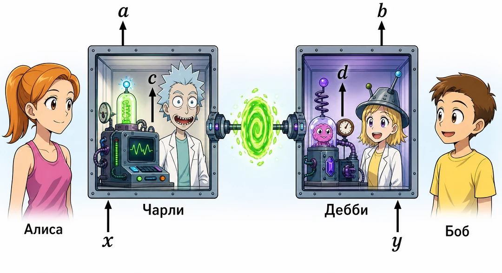

**Рисунок 1.** Сценарий мысленного эксперимента Бонга и соавторов[^31]. Запутанное квантовое состояние распределено между двумя точками. В одной из них Чарли проводит фиксированное измерение над одной из двух частиц и получает исход $c$. Алиса, однако, рассматривает ящик с частицей и Чарли как замкнутую квантовую систему и решает выполнить над ним измерение $x$, получая исход $a$. (Заметьте: $x$ выбирается *после* установления $c$.) В частном случае $x=1$ она напрямую спрашивает Чарли о его исходе и выдаёт $a=c$. В другой точке находятся ещё два наблюдателя — Дебби и Боб, действующие аналогично. Если наблюдаемая извне статистика $P(a,b|x,y)$ нарушает так называемое *неравенство локального дружелюбия*, то из локальности и отсутствия супердетерминизма следует, что не для всех $x,y$ может существовать совместное распределение $P(a,b,c,d|x,y)$, описывающее наблюдения всех агентов.

---

Как показывает теорема Белла, в квантовой теории не всегда можно приписать совместные распределения вероятностей всем переменным, которые контрфактически могли бы наблюдаться в будущем. Можно было бы всё же надеяться, что существует «классический» режим мира, где о совместно распределённых переменных можно говорить в обычном смысле, если ограничиться переменными, которые *фактически* наблюдаются. В повседневном мире это обычно так: все люди разделяют общую границу Гейзенберга, и всем, что мы наблюдаем в течение жизни, пока можно поделиться со всеми остальными. Все наблюдения — исходы, переживания — входят в большую булеву алгебру высказываний; можно помыслить совместное распределение вероятностей, соответствующее тому, во что любой гипотетический внешний наблюдатель должен верить *относительно мира*. Тогда то, во что нам следует верить относительно собственных будущих наблюдений, по крайней мере в принципе выводилось бы из него как маргинальное распределение (на практике мы, конечно, пользуемся эвристическими упрощениями и сокращениями).

Но ситуация изменится, как только мы воплотим в нашем мире расширенные эксперименты с другом Вигнера вроде описанного выше. Приведённые результаты показывают, что наблюдения *a*, *b*, *c* и *d*, сделанные соответственно Алисой, Бобом, Чарли и Дебби, *не принадлежат* булевой алгебре высказываний описанного типа. Если наблюдаемая извне статистика $P(a,b|x,y)$ нарушает *неравенство локального дружелюбия*, то при всех *x*, *y* *не может* существовать совместное распределение $P(a,b,c,d|x,y)$ наблюдений *всех четырёх* наблюдателей, из которого получается $P(a,b|x,y)$, — если не нарушается принцип локальности, принцип отсутствия супердетерминизма или оба сразу. Но если такого распределения нет, все четыре наблюдателя *не могут* применить «стандартную методологию», чтобы определить ожидаемые исходы. Они не могут начать с убеждений о фактах мира, включая $a$, $b$, $c$, $d$, и вывести из них свою малую часть — маргинальное распределение по *$a$* и *$b$*. В зависимости от интерпретации квантовой теории можно заключить, что Чарли и Дебби по отдельности способны применить правило Борна и получить вероятности $P(c)$ и $P(d)$, но правильность этих назначений никогда нельзя проверить извне.

В недавней публикации[^32] мы ввели терминологию, предназначенную для выражения сути этого наблюдения:

**Ограничение A (неформально):** наши физические теории не дают — а иногда и *не могут дать* — совместные предсказания будущих наблюдений всех **а**гентов.

Более формально ограничение A — свойство заданной теории *T* (например, квантовой теории, дополненной предположениями о локальности и отсутствии супердетерминизма), причём предсказания считаются формализованными в виде распределений вероятностей. Внутри *T* ограничение A может действовать в одних сценариях — моделях, экспериментах — и не действовать в других. В приведённом выше сценарии друга Вигнера оно относится к *N* = 4 наблюдателям, а в сценарии симуляции из [раздела 1](#Section1) — к *одному*, то есть *N* = 1.

Случаи *N* = 1 и *N* ≥ 2 имеют существенно разные интерпретации. При *N* = 1 ограничение A указывает на недостаток данной физической теории: агент хочет предсказать собственные будущие наблюдения, но не может. При *N* ≥ 2 оно говорит, что агент не может получить такие предсказания посредством предсказания свойств внешнего мира, являющихся фактами для всех агентов. К вопросу о толковании этого различия мы ещё вернёмся.

Предположим также, что теория *T* *интерсубъективно эмпирически полна* в следующем смысле: для любого эксперимента, результаты которого можно записать и сделать доступными всем внешним наблюдателям — необязательно всем участникам, таким как Чарли и Дебби, — теория *T* действительно даёт статистическое предсказание. Тогда **ограничение A применимо к теории *T* лишь в тех сценариях, где наблюдения агента *невозможно записать извне***, то есть где существует некоторый «эпистемический горизонт»[^33], отделяющий одних наблюдателей от других. Именно так устроен мысленный эксперимент Бонга и соавторов: как мы уже видели, невозможно в каждом отдельном запуске записать исходы *a*, *b*, *c*, *d* и получить статистику, пригодную, скажем, для публикации в научном журнале. Если спросить Чарли или Дебби об их исходах, это в общем случае возмутит эксперимент и помешает нарушению неравенства локального дружелюбия. Подобным образом в сценарии из [раздела 1](#Section1) третье лицо — например, врач — не могло даже *решить, произошло ли* интересующее агента событие в отдельной реализации. Именно поэтому врач отмахнулся от вопроса пациента: физикалист может утверждать, что факты мира от третьего лица исчерпывают всё, что можно сказать, а главный признак «факта» — интерсубъективная внешняя доступность.

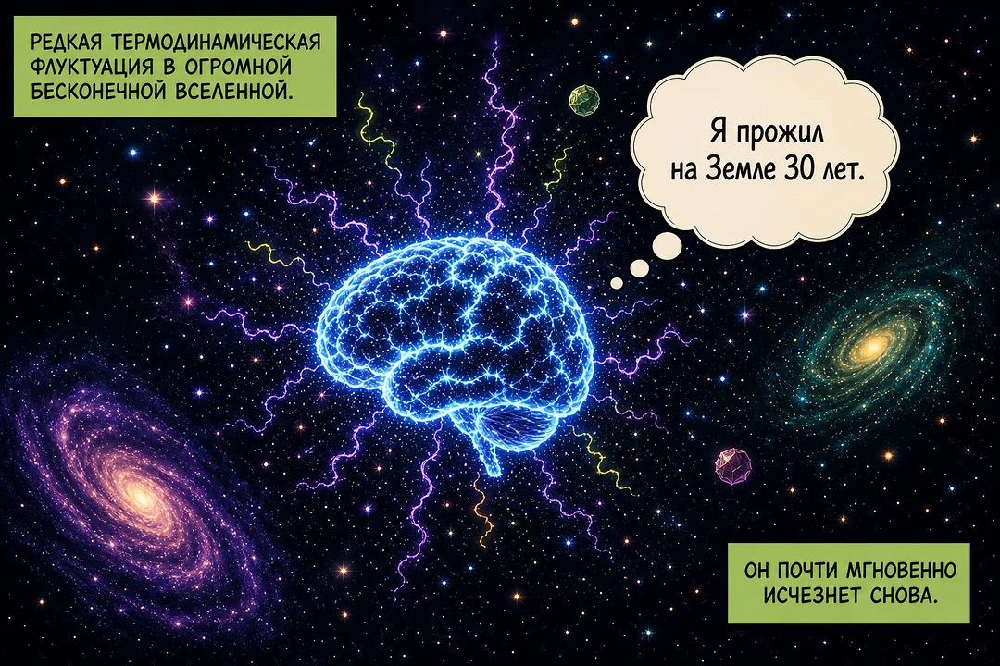

В работе[^34] мы подробно объяснили, почему считаем ограничение A сердцевиной ещё нескольких загадок оснований физики и философии. Здесь я лишь кратко набросаю две из них. Первая — космологическая **проблема больцмановского мозга**. За обстоятельным введением я отсылаю к работам Кэрролла[^35]; ниже следует предельно краткое, почти карикатурное резюме. Пусть модель Вселенной предсказывает, что она комбинаторно огромна. Тогда термодинамические флуктуации породят в ней всевозможные маловероятные события, включая больцмановские мозги: локальные скопления материи, случайно функционально эквивалентные человеческому мозгу и снабжённые ложными воспоминаниями и мыслями вроде «я прожил на Земле 30 лет». Что, если космологическая модель предсказывает, что больцмановских мозгов намного — скажем, порядка 10100 раз — больше, чем «обычных» мозгов, эволюционировавших на планетах? Интуитивно кажется, что тогда нам следует ожидать, что мы — больцмановские мозги. Но такой мозг вскоре обычно наблюдал бы нечто совершенно неожиданное, если бы не распался немедленно: например, высокотемпературное излучение вместо привычного ночного неба. Мы этого не видим и, по-видимому, не распадаемся; значит, мы, похоже, не больцмановские мозги[^36]. Получается ли, что соответствующая космологическая модель тем самым опровергнута?

Важно понимать: космология — и современные физические теории вообще — сообщает лишь оценку числа больцмановских и, возможно, обычных мозгов при заданной модели. Но она *не говорит, во что вам следует верить*, если вы спрашиваете, к какому типу относитесь, — в частности, какую вероятность следует приписать следующему необычному наблюдению больцмановского типа, условившись, например, что в следующий момент вы всё ещё существуете. Утверждение, будто эти вероятности задаются подсчётом частот, равносильно принятию чего-то вроде принципа безразличия Элги[^37], а это логически независимое *дополнение* к физическим теориям[^38]. Космологам, безусловно, было бы полезно таким рассуждением исключать модели с преобладанием больцмановских мозгов, но действует ограничение A для одного наблюдателя, *N* = 1: физика не говорит, следует ли вам считать себя больцмановским мозгом.

Второй класс загадок, где действует ограничение A, напоминает парадокс телетранспортации Парфита[^39]: это сценарии, в которых наблюдатель проходит через процедуру дублирования — вспомните эпизод «Враг внутри» из «Звёздного пути». Предположим, вас просканируют во всех подробностях, уничтожив оригинал, как в [разделе 1](#Section1), а затем создадут большое число *N* копий, каждая из которых в будущем увидит что-то своё. Чего вам следует ожидать от будущего опыта? Поначалу естественно приписать каждой копии равную вероятность. Но что делать, если создано бесконечно много копий и с ростом *n* копия номер *n* всё сильнее отклоняется от оригинала, хотя различие между копиями *n* и *n* + 1 остаётся сколь угодно малым? А если копии создаются ещё и в разные *моменты времени*? Мы не знаем, что говорить в таком случае, а физические теории ничего не сообщают о том, какого следующего опыта вам следует ожидать[^40]. Это пример ограничения A для *N* = 1. В[^41] мы строим более сложную версию мысленного эксперимента с размножением, демонстрирующую ограничение A для *N* = 2 и устойчивую к будущим изменениям физических теорий; она напоминает вероятностный вариант парадокса Фраухигера — Реннера[^42].

Алгоритмический идеализм, описанный ниже, можно понимать как реакцию на ограничение A. В этой концептуальной системе ограничение A для любого *одиночного* агента (*N* = 1) считается серьёзной проблемой, которую необходимо смягчить: оно показывает неспособность предсказать результат *реального эксперимента, который кто-то может провести*. Например, *вы* в принципе — а в, возможно, не столь далёком будущем и на практике — можете согласиться на определённое копирование в компьютерную симуляцию и *посмотреть, что с вами произойдёт*. Пусть результат нельзя сделать интерсубъективно доступным — выше мы объяснили, что это вообще условие применимости ограничения A, — абсурдно считать, будто ничего нельзя сказать о том, какой исход вам следует ожидать: вероятностно, в терминах правдоподобия[^43] или в иной математической формализации. Мир ответит сопротивлением и породит некоторый субъективный исход; что-то должно определять его природу. Даже заявление, будто *ничего сказать нельзя*, — всего лишь реплика человека, требующая уточнения, а значит, математической формализации. Алгоритмический идеализм предлагает конкретное разрешение ограничения A для *N* = 1 посредством приведённого ниже [постулата 2](#Postulate2) и его формализации в выбранной математической модели.

Однако алгоритмический идеализм не претендует на разрешение ограничения A для *N* ≥ 2, а предлагает его принять: согласно его предсказаниям, разные агенты *в общем случае не разделяют* один общий мир, в который они будто бы встроены. «Объективная реальность» вместо этого оказывается приближённым, эмерджентным статистическим явлением, действующим не всегда (см. [подраздел 6.3](#Subsection6.3)). Ограничение A для *N* ≥ 2 — вместе с недавними результатами[^44], согласно которым при некоторых естественных предположениях от него будут страдать все будущие физические теории, — рассматривается как подтверждение правильности стратегии алгоритмического идеализма: отказаться от предположения, что агенты фундаментально встроены во внешние миры.

## 4. Алгоритмический идеализм в двух словах

Как ответить на ограничение A? При *N* ≥ 2 агентах отсутствие совместного распределения вероятностей для наблюдений всех агентов можно истолковать[^45] как свидетельство того, что наблюдения и события не всегда следует считать абсолютными (см., например,[^46]); описанный ниже алгоритмический идеализм с этим согласен. Но ограничение A для *одного* агента, *N* = 1, ещё тревожнее: агент может провести эксперимент и узнать некоторый исход, а сказать, какого наблюдения ему следует ожидать, невозможно. Выше я объяснил, почему считаю это абсурдным и вижу здесь недостаток наших теорий. Если принять эту точку зрения, как на неё реагировать?

Один вариант — ещё твёрже придерживаться физикализма и настаивать, что вопрос «Какого следующего опыта мне следует ожидать?» обычно не определён корректно. Тогда его следует считать прагматическим вопросом, который иногда вообще не имеет ответа, а часто допускает лишь *расплывчатый* ответ — подобно вопросу *«Живы ли вирусы?»*

Но здесь я предлагаю исследовать второй вариант: предположить, что у конкретной версии этого вопроса от первого лица *всегда* есть объективный ответ, и разработать теорию, способную хотя бы в принципе его дать. Мотивация двойная. С практической стороны однажды нам отчаянно понадобится ориентир в экзотических ситуациях вроде описанной в [разделе 1](#Section1), и точная теория, предлагающая такой ориентир, но *одновременно* согласующаяся с обычными физическими предсказаниями в повседневных ситуациях, была бы весьма полезным инструментом. Кроме того, как я утверждал в [разделе 2](#Section2), квантовая теория подсказывает, что вопрос «Какого следующего наблюдения мне следует ожидать?» фундаментальнее, естественнее и плодотворнее вопроса «Что имеет место в мире?». Можно воспринять это как намёк современной физики: пытаясь ответить на первый вопрос, а не на второй, мы вправе надеяться приблизиться к истине и косвенно узнать нечто интересное также о мире.

Цель алгоритмического идеализма — реализовать этот второй вариант. Несмотря на название, я стремлюсь к формальному, математически строгому подходу, где понятия высокого уровня вроде сознания или убеждения не играют фундаментальной роли.

Первый шаг — отложить понятие «убеждения» и сосредоточиться на текущем состоянии наблюдателя в отдельный субъективный момент, понимаемом абстрактно и информационно-теоретически. Для человека таким состоянием мог бы служить, например, паттерн[^47] нейронных связей мозга; это описание нужно лишь для интуиции и не должно становиться частью самой теории. Оно приблизительно соответствует тому, что Парфит называл «стадией личности»[^48]. Отсюда, помимо прочего, следует, что «агенты» и «наблюдатели» *не будут* примитивными понятиями алгоритмического идеализма. Ими станут лишь мгновенные «снимки» паттерна, структуры или информационного содержания, определяющего агента либо наблюдателя *в данный момент*. Такие снимки мы назовём «состояниями „я“»[^49]; иллюстрацию и дополнительные пояснения см. на рисунке 2.

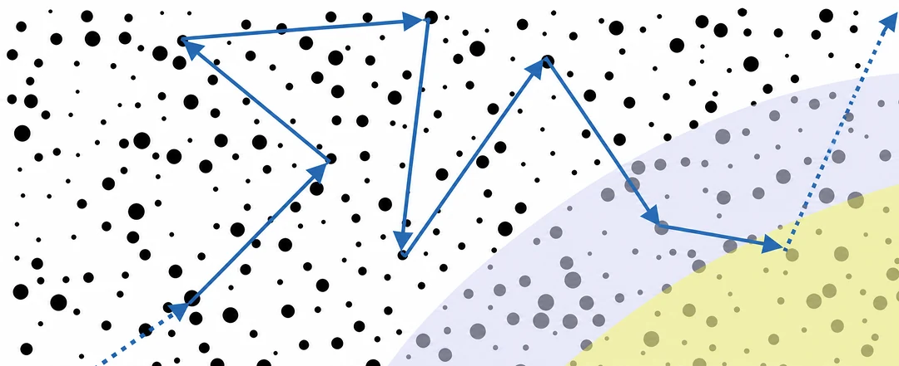

**Рисунок 2.** Множество состояний «я» $\mathcal{S}$, обычно моделируемое как счётно бесконечное множество, изображено чёрными точками. Состояния «я» — просто абстрактные паттерны, которые можно формализовать, например, конечными двоичными строками или натуральными числами. Лишь небольшое их подмножество, выделенное голубым, допускает интерпретацию как описание *агента* — точнее, его мгновенного снимка. И только совсем малая часть этих состояний, выделенная жёлтым, допускает интерпретацию как *сознательные* состояния «я». Для алгоритмического идеализма важны не агентность и не сознание, а исключительно абстрактное математическое описание. В частности, оно содержит структуру, определяющую, какие состояния $y$ более или менее вероятны при текущем состоянии $x$. Если описать это условным распределением вероятностей, получится марковский процесс. Однако даже в простейшей модели алгоритмического идеализма — битовой — правдоподобие задаётся бесконечным семейством алгоритмических априорных распределений. Одни состояния «я» в среднем встречаются вероятнее других, что обозначено размером точек. На рисунке не показана абстрактная *структура вычислимости*, которая в конечном счёте определяет вероятности переходов и соответствует предсказанию универсального метода индукции[^50].

---

Второй шаг — отказаться от всех человекоцентричных аспектов и перейти к полностью абстрактному подходу. Состоянием «я» может быть *любой* паттерн из некоторого математически и абстрактно определённого множества всех возможных паттернов. Лишь ничтожная их часть заслуживала бы интерпретации как описание мгновенного состояния «наблюдателя» — тем более человека или сознательного наблюдателя. На искомом фундаментальном уровне вводить конкретную модель наблюдателя или делать определённые предположения о его составе и функциях было бы совершенно неуместно. Самый осторожный и последовательный подход должен быть максимально абстрактным: всё, что мы привыкли связывать с наблюдателями или агентами, временно рассматривается как контингентное.

Так мы приходим к первому постулату алгоритмического идеализма:

> **Постулат 1** (состояния «я»). *Существует множество $\mathcal{S}$ «состояний „я“» — совокупность паттернов, одним из которых можно быть в каждый субъективный момент. Всё, что можно сказать о данном агенте в этот момент, включая все выводы о его прошлом или будущем, определяется его состоянием «я».*

В частности — и, возможно, это наиболее контринтуитивный тезис, — алгоритмический идеализм *отрицает, что агенты фундаментально встроены в некоторый внешний мир*. В каждый момент агент *полностью* характеризуется своим состоянием «я», то есть автономным паттерном, а *не* пространственно-временным положением внутри внешнего мира. Например, в проблеме больцмановского мозга существует множество локально неразличимых копий агента. Алгоритмический идеализм отвергает привычную интуицию «самолокализующейся неопределённости», будто агент *в действительности* является одной из копий, но не знает какой. Агент в данный субъективный момент и есть его состояние «я»; этот абстрактный паттерн просто представлен или реализован в каждой копии. В некотором смысле агент должен мыслить себя как *класс эквивалентности* всех этих реализаций — обычных и больцмановских мозгов, а также любых иных, потенциально совершенно непохожих воплощений.

На первый взгляд это абсурдно. Разве вскоре агент не совершит наблюдение, которое подтвердит либо опровергнет опасение, что он — больцмановский мозг, и тем самым ретроспективно не установит, что он *в действительности был* копией на планете, а не случайной флуктуацией где-то в космосе? При более внимательном рассмотрении кажущееся противоречие снимают два соображения. Во-первых, алгоритмический идеализм специально построен так, чтобы обходить «стандартную методологию» из [раздела 3](#Section3) и позволять агентам предсказывать следующее наблюдение, *не основываясь* на ожидаемом состоянии мира, в который они встроены. Поэтому то, чего им следует ожидать, по построению *не может* зависеть от того, «в действительности» окружены они планетоподобной средой или высокоэнтропийным излучением. Во-вторых, как будет объяснено в [разделе 6](#Section6), алгоритмический идеализм предсказывает, что агенты часто вправе считать себя «эффективно встроенными»: происходящее будет с превосходной точностью выглядеть *так, словно* они являются частью внешнего мира с алгоритмически простыми вероятностными законами природы. В космологическом примере отсюда следует, что следующим опытом агента, вероятнее всего, станет «обычная жизнь на планете», независимо от числа больцмановских мозгов, хотя вопрос о том, *является ли он на самом деле* больцмановским мозгом, поставлен некорректно. Подробнее это обсуждается ниже, в [разделе 6](#Section6).

Отказавшись от стандартной методологии, мы нуждаемся в постулате, определяющем, какого следующего опыта агенту[^51] следует ожидать. Поскольку мы не основываем ответ на внешнем мире в обычном смысле, он может зависеть лишь от мгновенного состояния «я» агента. А раз алгоритмический идеализм обходится без расплывчатых слов вроде «убеждение» и «опыт», исходный вопрос следует заменить другим: *если сейчас агент находится в состоянии «я» $x$, в каком состоянии $y$ он, вероятно, окажется затем?* Обосновать ответ привычными законами физики по построению нельзя. Вместо этого алгоритмический идеализм опирается на более слабое предположение, лежащее в основе самого доверия к эмпирической науке: *индукция возможна*. Точнее, эта идея воплощается в следующем постулате:

> **Постулат 2** (изменение состояния). *Если сейчас вы находитесь в состоянии «я» $x$, следующим будет другое состояние $y$, а то, какое именно, проявляется для вас как случайный эксперимент. Правдоподобие каждого следующего $y$ при данном текущем $x$ имеет объективное значение: если бы вы знали своё текущее состояние «я», оно выражало бы то, чего вам следует ожидать дальше. Математическая структура, задающая это значение, формализует универсальный метод индукции $M$.*

В широком смысле индукция — способ предсказывать будущие наблюдения, продолжая регулярности прошлых. «Универсальным» я называю метод, работающий не только при предположении, что мы перемещаемся внутри нашей Вселенной, но и в большом классе мыслимых сред. Возможность индуктивного вывода — одна из главных предпосылок научного метода. Здесь мы постулируем, что индукция в принципе *всегда* возможна, даже в экзотических обстоятельствах, но следующим *косвенным* образом: существует метод индукции **$M$**, и правдоподобие того, что следующим вы станете **$y$**, если сейчас вы — **$x$**, в точности совпадает с предсказанием **$M$**. Иначе говоря, гипотетическое третье лицо, применяющее метод **$M$**, могло бы правильно — хотя и не детерминистически — предсказать будущее состояние «я» любого агента, получив полное описание его текущего состояния. Следствие [постулата 2](#Postulate2): *регулярности, присутствующие в текущем состоянии «я», склонны сохраняться в вашем частном будущем*, поскольку методы индукции приписывают этому высокую вероятность.

Вероятности, получаемые методом индукции, естественно истолковывать *байесовски*: многие методы начинаются с выбора априорного распределения и применяют байесовское обновление при поступлении новой информации — в частности, так устроена индукция Соломонова, используемая ниже в битовой модели. Но здесь математическая формулировка метода индукции отделяется от своего эпистемического происхождения: вместо описания чьих-то убеждений о неизвестном будущем заданные ею значения трактуются как своего рода *объективные шансы* перехода из одного состояния «я» в другое. Точнее, их предполагается понимать подобно тому, как DEJI Бергхофера понимает квантовые вероятности: не как выражение фактических убеждений, а как выражение того, *во что следовало бы верить*, если бы было известно текущее состояние «я»[^52].

Постулаты 1 и 2 намеренно сформулированы так, чтобы допускать несколько строгих математических реализаций, или *моделей*. Каждый выбор множества состояний «я» $\mathcal{S}$ и метода индукции $M$ задаёт отдельную модель. Простая предварительная модель — *битовая* — была представлена в работе[^53] и будет описана в [разделе 5](#Section5). Разные математические модели и связанные с ними методы индукции могут опираться на разные определения правдоподобия: на одно условное распределение вероятностей, на семейство *нескольких* таких распределений — как в битовой модели, — на понятие неточной вероятности[^54] или на меры правдоподобия[^55]. Точную концептуальную интерпретацию этих «значений» правдоподобия, сейчас лишь набросанную в [постулате 2](#Postulate2), возможно, придётся подбирать отдельно для каждого случая. Поэтому алгоритмический идеализм следует считать скорее *концептуальной системой*, чем единственной теорией: он допускает множество математических воплощений.

В качестве аналогии рассмотрим общую идею, что физическое пространство может быть не плоским, а искривлённым или, шире, неевклидовым. У одной этой идеи есть множество математических реализаций с весьма различными физическими предсказаниями, хотя *некоторые* следствия могут быть универсальными — например, нарушение постулата о сумме углов треугольника. Какая из получившихся теорий верна, если верна хоть одна, в конечном счёте решается эмпирическим наблюдением и экспериментом. Представление о неевклидовой геометрии нашего мира появилось ещё до теории относительности. В 1872 году немецкий астрофизик Карл Фридрих Цёлльнер[^56] предположил, что мы можем жить в неевклидовой искривлённой Вселенной. Это позволило предложить решение парадокса Ольберса: при положительной кривизне Вселенная могла бы обладать конечным объёмом без границы, что объясняло бы темноту ночного неба. В итоге новые экспериментальные данные — прецессия перигелия Меркурия и результат опыта Майкельсона — Морли — потребовали очередного изменения концептуальной системы, приведшего к общей теории относительности: искривлённым следовало считать не пространство, а *пространство-время*. Тем не менее справедливо сказать, что основная идея Цёлльнера оказалась верной: конечность неевклидовой Вселенной разрешает парадокс Ольберса.

Задним числом ясно: Цёлльнеру не следовало надеяться априори угадать правильную теорию Вселенной, но он мог верно предвидеть общую область математики, необходимую для её формулировки, — дифференциальную геометрию. Именно она позволяет описывать пространственные геометрии, локально привычные, но потенциально необычные глобально. Подобным образом можно угадать область математики, релевантную всем формализациям алгоритмического идеализма. В *стандартной* картине агента или наблюдателя его состояние содержит большой объём памяти и опыта *внешнего мира*, то есть переменные, *коррелирующие* с переменными, описывающими существенные аспекты внешней Вселенной. Это парадигматический сценарий обычной теории информации[^57]: состояние наблюдателя соответствует информации — причём *информации о* внешнем мире. Алгоритмический идеализм, напротив, рассматривает структуру наблюдателя в данный момент и её регулярности, необходимые для применения метода индукции, *без ссылки на что-либо внешнее*. Нужна область математики, изучающая структурные регулярности в конкретной автономной совокупности данных, а не в случайной величине, потенциально коррелирующей с другой. Такая область существует: это алгоритмическая теория информации (АТИ)[^58], откуда и происходит название подхода.

## 5. Алгоритмическая теория информации и битовая модель

Алгоритмическая теория информации изучает информационное содержание отдельных фрагментов данных, обычно представленных конечными двоичными строками $\{0,1\}^*=\{\varepsilon,0,1,00,01,10,11,000,001,\ldots\}$, где $\varepsilon$ — пустая строка, либо целыми числами $\mathbb{N}_0=\{0,1,2,3,4,5,\ldots\}$. Самая известная величина в АТИ — *сложность Колмогорова*. Если $x$ — двоичная строка или целое число, то $K(x)$ обозначает длину кратчайшей программы для универсальной машины Тьюринга *U*, выдающей $x$. Для удобства сосредоточимся на двоичных строках. Пусть строка $x$ длины $n$ получена $n$ бросками честной монеты. Тогда с высокой вероятностью $K(x)\approx n$, поскольку кратчайшей программой, генерирующей $x$, обычно будет «напечатать $x$», то есть программа, перечисляющая все биты $x$. Если же $x$ — строка из $n$ нулей, $x=\underbrace{000\ldots 0}_n$, то $K(x)\approx\log n$: машине Тьюринга достаточно сообщить, сколько раз печатать ноль, а для этого нужно примерно $\log n$ двоичных цифр числа $n$ (логарифм по основанию 2). Аналогично можно рассуждать, например, о первых $n$ двоичных цифрах числа $\pi$ или $\exp(\sqrt{2})$.

Точное определение сложности Колмогорова зависит от выбора модели машины Тьюринга. Например, описанную выше сложность $K$ обычно задают для так называемых *префиксно-свободных* машин, где каждая программа должна описывать собственный конец; для «голых» машин без этого требования существует другая версия, $C$. Множество возможных определений базовых величин АТИ порождает и множество способов положить её в основу формализации алгоритмического идеализма.

АТИ позволяет, например, спросить: насколько вероятно, что машина Тьюринга $U$, получив случайный вход, выдаст заданный результат $x$? Точное определение вновь зависит от деталей работы машины. Для префиксно-свободных машин учебники вводят *алгоритмическую вероятность*

$$
m(x):=\sum_{p:U(p)=x} 2^{-\ell(p)},
$$

где $\ell(p)$ — длина двоичной строки (программы) $p$. Это величина интерпретируется как вероятность того, что $U$ выдаст $x$ на входе, выбранном последовательностью бросков честной монеты. Оказывается, что

$$
-\log m(x)=K(x)+\mathcal{O}(1).\tag{1}\label{eq1}
$$

Такая запись означает, что абсолютная величина разности между $\log m(x)$ и $K(x)$ ограничена глобальной константой, не зависящей от $x$. Уже этот пример показывает особенность научной практики АТИ: исследователей обычно интересуют не конкретные *значения* величин вроде $K(x)$ или $m(x)$ — как правило, эти числа вообще невычислимы, — а их масштабирование относительно других величин, например длины $x$, или их взаимное сравнение[^59]. Такой подход снимает и большинство опасений, связанных со свободой выбора универсальной машины Тьюринга $U$: для любой другой универсальной машины $V$ выполняется $K_U(x)=K_V(x)+\mathcal{O}(1)$, где $K_U$ — сложность Колмогорова относительно машины $U$. Странное взаимодействие точного определения и своего рода расплывчатого сравнительного применения действительно создаёт содержательную область исследования — и огромную математическую красоту. Но убедиться в этом средствами самой теории невозможно: это можно лишь пережить, работая с АТИ.

Уравнение $\eqref{eq1}$ говорит, что более *простые* строки $x$ — имеющие более короткое описание на универсальной машине Тьюринга — *вероятнее* относительно распределения $m$. Это общее свойство вероятностных величин, вводимых и изучаемых в АТИ: они предпочитают простоту, напоминая бритву Оккама. Особенно важно, что АТИ позволяет задавать условные версии $K$ и $m$, потенциально полезные для формализаций алгоритмического идеализма. Например, выражения[^60] $K(y|x)$ и $C(y|x)$ измеряют, сколько дополнительной информации нужно машине для получения $y$, если $x$ предоставлено бесплатно. А условные распределения $m(y|x)$ и $M(y|x)$ сообщают соответственно, насколько вероятно, что машина выдаст $y$ при бесплатно предоставленном $x$, либо что она выдаст $y$ после того, как уже выдала $x$.

Интуитивно условная вероятность вроде $M(y|x)$ велика тогда и только тогда, когда $y$ легко получить из $x$ на машине Тьюринга — например, если $y$ содержит многие вычислимые регулярности $x$. Это подсказывает, что выражение $M(y|x)$ можно положить в основу метода индуктивного вывода, а результат способен сыграть роль метода индукции из [постулата 2](#Postulate2). По крайней мере для одной версии условной вероятности эту интуицию можно сделать строгой. Получается метод индуктивного вывода, известный как индукция Соломонова[^61]:

**Индукция Соломонова.** Пусть вы наблюдаете биты один за другим и к настоящему моменту увидели $n$ битов $x_1^n = x_1 x_2 \ldots x_n$. Тогда предскажите следующий бит $b$ с вероятностью $\mathbf{M}(b|x_1^n)$ — вероятностью того, что универсальная монотонная машина Тьюринга (определённая в[^62]) выдаст $b$ после строки $x_1^n$.

Качество этого метода предсказания показывается следующим образом[^63]. Предположим, наблюдаемые биты *в действительности* порождаются неизвестным вам вычислимым процессом $\mu$ — «рекурсивной мерой» в терминологии[^64]. Тогда с $\mu$-вероятностью один

$$
\lim_{n\to\infty} |\mathbf{M}(b|x_1^n)-\mu(b|x_1^n)|=0\quad (b\in\{0,1\}).\tag{2}\label{eq2}
$$

То есть в долгосрочной перспективе алгоритмическая вероятность $\mathbf{M}$ почти наверное согласуется с действительными вероятностями $\mu$, задаваемыми неизвестным вычислимым процессом, который генерирует наблюдаемые биты. Пусть, например, процесс всегда детерминистически выдаёт бит 1: $\mu(1^n)=1$ для всех $n\in\mathbb{N}$, где $1^n=\underbrace{111\ldots 1}_n$. Тогда $\mathbf{M}(0|1^n)=2^{-K(n)+\mathcal{O}(1)}$ стремится к нулю и для большинства $n$ имеет порядок $1/n$. В этом смысле после $n$ единиц индукция Соломонова, как и ожидается от метода индукции, предсказывает, что следующим вы, вероятно, не увидите ноль.

На основе этого результата в работе[^65] я построил предварительную формализацию алгоритмического идеализма — **битовую модель**. Множество её состояний «я» совпадает с множеством конечных двоичных строк, $\mathcal{S}=\{0,1\}^*$, а методом индукции служит индукция Соломонова. Конкретнее, утверждается, что за состоянием «я» $x$ всегда следует либо $x0$, либо $x1$: $y$ получается дописыванием к $x$ одного бита $b$, а вероятность[^66] равна $\mathbf{M}_U(b|x)$. Точнее, правдоподобие перехода к $y=xb$ характеризуется множеством всех $\mathbf{M}_U(b|x)$ по всем универсальным монотонным машинам Тьюринга $U$, а предсказаниями теории по определению считаются те, которые не зависят от выбора $U$. Тем самым понятие «правдоподобия» здесь шире спецификации одного фиксированного распределения вероятностей; подробно это обсуждается в[^67].

Эта предельно простая модель весьма сильна: она допускает строгие доказательства нескольких значимых предсказаний, которые я опишу в следующем разделе. Но у неё есть и нежелательные свойства, мотивирующие мою нынешнюю работу над улучшенной версией. В частности, из неё следует, что мгновенное состояние $x$ всегда содержит полную информацию обо всех *предыдущих* состояниях «я» — это префиксы $x$. Такое предположение и нереалистично, если иметь в виду, например, людей, и ничем не мотивировано. Это лишь артефакт исторически сложившегося способа разработки АТИ.

В оставшейся части статьи я сосредоточусь на концептуальной стороне теории и отложу технические подробности АТИ. Вместо строгих доказательств основных предсказаний в конкретной реализации вроде битовой модели я изложу главные идеи, позволяющие ожидать, что эти предсказания следуют из постулатов 1 и 2 и за пределами битовой модели.

## 6. Предсказания алгоритмического идеализма

Всякая новая теория должна с хорошей точностью воспроизводить предсказания прежних теорий, согласуясь с уже имеющимися эмпирическими результатами, а затем давать нечто большее. Чтобы алгоритмический идеализм оказался успешным, он должен:

- согласовываться с предсказаниями наших физических теорий в стандартных ситуациях;
- объяснять факты, которые физические теории лишь принимают как данность, — например, почему нам обычно кажется, что мы встроены в вероятностный мир с простыми законами природы;
- давать конкретные и, возможно, неожиданные предсказания для экзотических сценариев вроде проблемы больцмановского мозга или компьютерной симуляции агентов.

В этом разделе я покажу с помощью рассуждений о правдоподобии, опирающихся на постулаты 1 и 2 из [раздела 4](#Section4), что алгоритмический идеализм способен удовлетворить всем этим требованиям. В[^68] я дал строгие формулировки и доказательства таких утверждений для описанной выше битовой модели. Однако по уже названным причинам эту модель предстоит улучшить. Я надеюсь, что неформальная аргументация настоящей статьи послужит ориентиром при доказательстве утверждений в других математических формализациях алгоритмического идеализма. Во всяком случае она корректно передаёт концептуальную суть технических доказательств для битовой модели из[^69].

## 6.1. Согласованность с физическими предсказаниями в стандартных сценариях

Главный довод в пользу согласованности алгоритмического идеализма с физическими теориями состоит в том, что *из самих физических теорий, по-видимому, следует принципиальная эмпирическая адекватность формальных методов индукции*. Рассмотрим агента, характеризуемого состоянием «я» *x*, которое содержит много данных. Как отмечалось выше, состояние «я» необязательно соответствует чему-то, что мы привычно считаем агентом или наблюдателем, поэтому возьмём планету Земля. В духе АТИ сосредоточимся на версиях алгоритмического идеализма, где множество возможных состояний «я» — конечные двоичные строки, $\mathcal{S}=\{\varepsilon,0,1,00,01,\ldots\}$. Чтобы сопоставить Землю с двоичной строкой, зафиксируем произвольный способ кодирования в битах приближённого описания её мгновенной[^70] конфигурации. Например, можно разбить оболочку от километра ниже до километра выше уровня моря на приближённые кубы со стороной 10−9 метра и для каждого куба сохранить несколько битов, описывающих примерный состав вещества. Получится огромный массив данных.

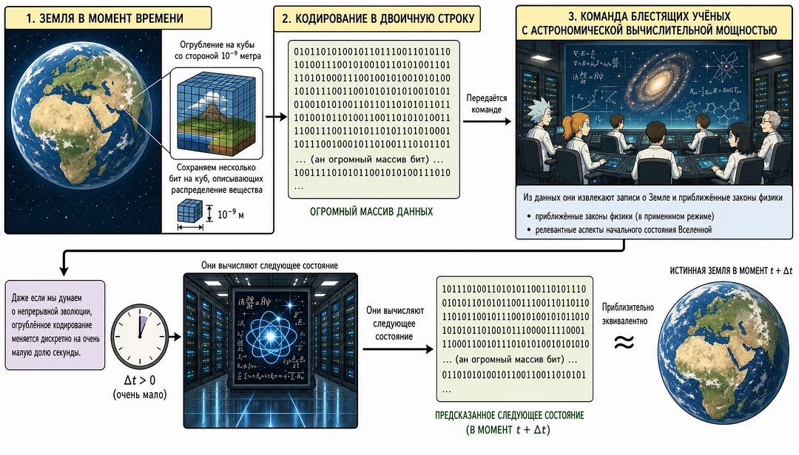

Ради аргумента представим, что эти данные переданы команде блестящих учёных с астрономической вычислительной мощностью. Мы просим их предсказать, что этот источник данных выдаст следующим. Даже если эволюция нашего мира мыслится непрерывной, результат дискретного кодирования *скачком* изменится через ненулевую, но очень малую долю секунды; именно это изменение должна предсказать третья сторона. Земля содержит *множество* записей о Вселенной, частью которой является: подземные окаменелости свидетельствуют о биологической эволюции, астрономические фотографии в библиотеках сообщают кое-что о внешнем по отношению к Земле мире, а фильмы и более тонкие особенности её структуры раскрывают аспекты физических законов в релевантном режиме. Разумно ожидать, что из этих данных в принципе можно извлечь *полное* описание релевантных законов физики и, скажем, существенных черт состояния Вселенной при Большом взрыве — в конце концов, именно это мы, люди, по-видимому, успешно делаем посредством науки. Значит, команда учёных должна справиться с задачей.

Этот мысленный эксперимент даёт первый шаг следующего трёхступенчатого рассуждения:

1. Опираясь на успех науки, мы эвристически заключили: хорошие методы индукции, получив описанное выше мгновенное состояние Земли, должны предсказывать те же вероятности её будущих состояний, что и лучшие научные теории. Если научные предсказания верны, верными будут и предсказания хороших методов индукции.
2. Затем прагматическую, эвристическую и методологическую интуицию следует поднять до точного математического утверждения: если дан *математически определённый* метод универсальной индукции $M$ — например, описанная выше индукция Соломонова, — то $M$ *тоже* должен правильно предсказывать вероятности будущих состояний Земли. Это гораздо менее интуитивно, поскольку вход $M$ — всего лишь голое состояние «я», а в битовой модели — длинная строка двоичных данных. Может показаться удивительным — а философски настроенному читателю и крайне сомнительным, — что одних данных *без встроенной семантики*, ссылок на пространственно-временную структуру и прочего достаточно для правильного предсказания. Но это гарантируют математические теоремы — по существу, $\eqref{eq2}$, если индуцированный стохастический процесс на состояниях «я» *вычислим*.
3. Первые два шага касаются только общих свойств универсальной индукции, сформулированных известными результатами АТИ. Лишь *теперь* вступает алгоритмический идеализм: он утверждает, что, *если вы являетесь текущим состоянием «я» Земли*[^71], *ваше следующее состояние определяется $M$* — в битовой модели алгоритмической вероятностью. Оно, в частности, *не* определяется законами мира, в который вы могли бы вообразить себя встроенным: в действительности вы никуда не встроены. Само $M$ и есть «закон природы», причём его действие зависит от голого состояния «я», а не от чего-либо внешнего.

Первые два шага показывают, что утверждение алгоритмического идеализма о том, *что произойдёт с вами, если вы — Земля* — точнее, если вы являетесь данными, полученными выбранной процедурой считывания в конкретный момент, — согласуется с тем, *что, согласно обычной физической картине мира, произойдёт с Землёй* в следующий момент.

Ничего особенного ни в Земле, ни в способе кодирования здесь нет. Можно взять *любой другой* объект, содержащий большой объём данных о нашем мире: человеческий мозг, жёсткий диск, левое полушарие какого-либо млекопитающего — при некотором уровне подробности описания. Во всех этих случаях [постулат 2](#Postulate2) должен говорить о том, *что произойдёт с вами, если вы — этот объект*[^72], почти то же самое — а асимптотически в точности то же, — что и физика.

Для битовой модели условия такой согласованности можно сформулировать точнее. Рассмотрим принимающую значения в двоичных строках случайную величину *x* в мире — техническая статья[^73] объясняет, как это согласуется с квантовой теорией, — которая меняется со временем так, что её длина не убывает. Например, видеокамера непрерывно снимает Таймс-сквер и записывает закодированные в битах кадры на жёсткий диск. Или возьмём описанное выше «состояние Земли», либо дискретизацию и произвольный вычислимый метод оцифровки вашего мозга с высокой точностью во времени, при котором вся прошлая информация сохраняется. Физические теории говорят, что физический мир порождает меру вероятности $\mu$ на возможных историях этой двоичной строки: скажем, кадры Таймс-сквер, где все пешеходы внезапно взмывают в небо, имеют исчезающе малую вероятность. Если истинна подходящая версия физического тезиса Чёрча — Тьюринга, то $\mu$ будет вычислимой мерой. Для этого вычислимыми должны быть и процесс, задающий релевантные аспекты мира, и определение случайной величины. Тогда выполняется уравнение $\eqref{eq2}$: в долгосрочной перспективе вероятностные предсказания алгоритмического идеализма совпадут с вероятностями, полученными из реальной физической эволюции.

Напомним: [постулат 2](#Postulate2) описывает не то, что мы или агент *фактически думаем* о следующем событии, а то, во что *следует верить*. В строгой формулировке выбранной математической модели, например битовой, он понимается как статистический закон природы. Это не *дополнение* к данным законам физики, а их *замена*[^74]. Поэтому решающее значение имеет теорема, гарантирующая согласованность со стандартными физическими законами в области их применимости. По существу, это область эмпирической науки — процессов, в которых со временем накапливается большой объём данных. Приведённое рассуждение объясняет, почему такую согласованность следует ожидать; в битовой модели известные результаты об индукции Соломонова и физических версиях тезиса Чёрча — Тьюринга превращают её в строгую теорему.

## 6.2. Внешний мир как эмерджентное приближённое явление

Алгоритмический идеализм предсказывает такую согласованность с физикой, но предыдущее рассуждение говорит лишь: агенты, которым кажется, что они встроены в простую вероятностную Вселенную, вероятно, и в будущем будут наблюдать подтверждения этому. Но *почему вообще должна выполняться исходная предпосылка*, если алгоритмический идеализм верен? Ведь один из его главных методологических принципов — отказ от предположения, что агент фундаментально встроен во внешний мир. Как тогда понять, *почему агенты, вероятно, достигают состояния «я», в котором им кажется, будто они эффективно встроены*, так что предыдущая аргументация применима и показывает, что они *останутся* встроенными?

Один из главных результатов, полученный для битовой модели и, хочется надеяться, верный гораздо шире, — следующее несколько техническое наблюдение из АТИ. Меры алгоритмической вероятности вроде $\mathbf{M}$ невычислимы. Однако часто они ведут себя очень похоже на вычислимую меру $\mu$, особенно если $\mu$ алгоритмически проста. В частности, это может произойти, если ранее наблюдавшиеся биты $x_1^n=x_1 x_2\ldots x_n$ случайно оказались типичным результатом меры $\mu$: интуитивно тогда и следующие биты, вероятно, будут распределены согласно $\mu$. Статистические регулярности в $x_1^n$ склонны сохраняться, потому что именно этого ожидает индукция. Возникает общая тенденция к «стабилизации» весьма регулярного статистического поведения — поведения по простой вычислимой мере $\mu$. Если так, эволюция состояния «я» агента приближённо описывается $\mu$, а значит, *по определению* существует[^75] вычисление на основе короткой программы, порождающей $\mu$. Чтобы предсказывать происходящее с агентом, можно *делать вид, что агент является частью вычислительного процесса, который порождает его состояние «я» согласно вычислимому распределению $\mu$*. Этот процесс и играет роль внешнего мира.

Для битовой модели упомянутый технический результат можно сформулировать так (подробности см. в[^76]):

**«Обратная индукция Соломонова».** Предположим, вы наблюдаете один за другим биты $x_1,x_2,x_3,\ldots$, распределённые согласно алгоритмической вероятности $\mathbf{M}(b|x_1^n)$ — формализации [постулата 2](#Postulate2) в битовой модели. Пусть $\mu$ — произвольная вычислимая мера на двоичных строках. Тогда с $\mathbf{M}$-вероятностью не менее $2^{-K(\mu)}$ выполняется

$$
\lim_{n\to\infty} |\mathbf{M}(b|x_1^n) -\mu(b|x_1^n)|=0\qquad (b\in\{0,1\}).
$$

Иными словами, для каждой вычислимой меры $\mu$ существует положительная вероятность, что алгоритмическая вероятность — а значит, и реальные шансы происходящего с агентом, условные по прошлым наблюдениям, — сойдётся к $\mu$. Но не все меры одинаково вероятны. Неформально малая $K(\mu)$ — и большая вероятность $2^{-K(\mu)}$ — означает существование вероятностного вычислительного процесса, порождающего $\mu$ короткой программой, то есть простого в этом смысле. Его можно представить работающим на машине со специальной областью — у машины Тьюринга[^77] выходной лентой, — содержащей состояние «я» $x$, которое меняется по мере вычисления. Как всякое подобное вычисление, процесс начинается в фиксированном начальном состоянии с короткой программы длины $K(\mu)$, сообщающей машине, что делать. Затем он разворачивается вероятностно и, помимо состояния «я», содержит *множество других вещей* — другие ленты, рабочую память и так далее, — так что эволюция состояния «я» может пониматься как «механически» вытекающая из всего этого.

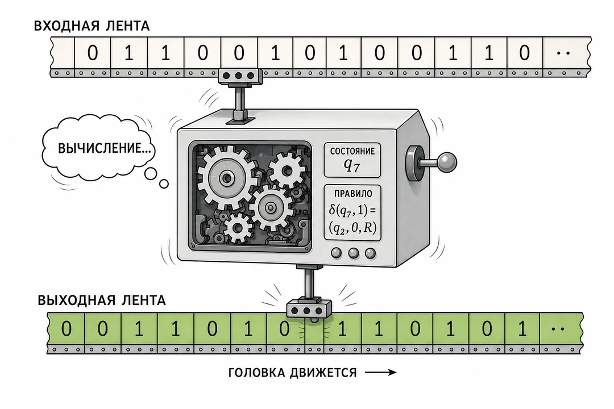

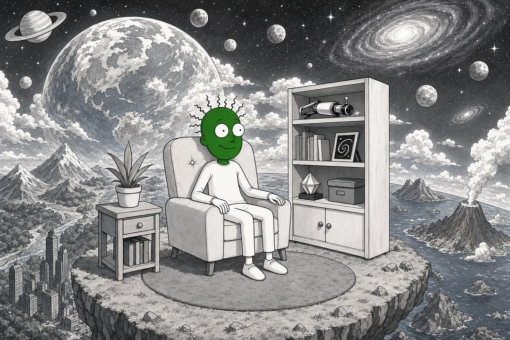

**Рисунок 3.** Если длина двоичной строки $x$ (слева, тёмно-зелёная) растёт согласно вычислимой мере $\mu$, можно вообразить соответствующее вычисление, порождающее строку, — например, на монотонной машине Тьюринга. В этом смысле можно делать вид, что $x$ встроена в более крупный **«внешний мир»** — вычисление, эволюция которого «механически» причиняет изменения строки. Аналогично наши переживания и воспоминания (справа, тёмно-зелёные) разворачиваются во времени так, что допускают объяснение посредством внешнего мира: вычислимого процесса, понимаемого как «механическая причина» эволюции состояния «я».

---

Но это весьма точное описание того, что мы называем внешним миром *W*: более крупного процесса, в который мы, по-видимому, встроены и который, как кажется, некогда находился в простом выделенном состоянии — Большом взрыве, — а затем вероятностно эволюционировал по простым законам. Мы можем рассуждать о вещах внешнего мира — например, о кирпиче, падающем на мою ногу, — и строить механистические причинные объяснения эволюции своего состояния «я»: ощущения боли и наблюдения красного пятна, когда я смотрю вниз. Тезис о формальной вычислимости мира в некотором смысле, позволяющей неформально понимать его как вычисление, хорошо известен, широко обсуждается и существует в разных версиях[^78].

Поэтому результат об обратной индукции Соломонова можно трактовать так: с вероятностью не менее $2^{-K(\mu)}$ вы обнаружите себя эффективно встроенным в описанный мир $W$, соответствующий $\mu$. Ваши вероятности от первого лица $\mathbf{P}_{\rm 1st}(y|x)=\mathbf{M}(b|x)$ — вероятности того, что с вами фактически произойдёт, где $x=x_1^n$ и $y=xb$, — будут очень близки к «вероятностям от третьего лица» $\mathbf{P}_{\rm 3rd}(y|x)=\mu(b|x)$ эволюции вашего представления в мире $W$. В битовой модели это сохранится в пределе $b\to\infty$, то есть бесконечно. В других формализациях, допускающих «забывание», мы ожидаем того же, пока состояние «я» сохраняет достаточно памяти о прошлых наблюдениях, указывающих, что мир $W$ хорошо их объясняет. Однако это ещё предстоит доказать математически; работа продолжается.

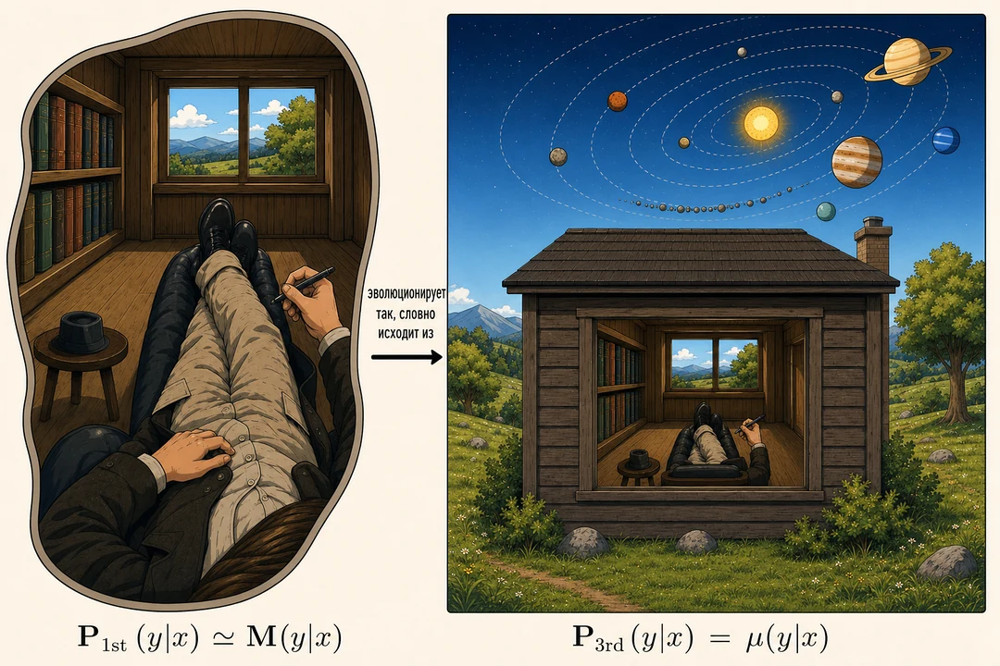

Следовательно, можно считать себя сейчас эффективно встроенным в некоторый мир $W$ — интуитивно до тех пор, пока не произойдёт катастрофическая потеря памяти, — хотя фундаментально вы никуда не встроены. В каком мире $W$ вам изначально следовало ожидать себя обнаружить, если бы вы могли об этом задуматься? Согласно алгоритмическому идеализму, ответ не был предопределён. В битовой модели можно сказать, что алгоритмически более простые миры[^79] — с меньшей длиной программы $K(\mu)$ — вероятнее. Поэтому неудивительно обнаружить себя в мире, описываемом небольшим набором математически простых физических законов. В частности, от картины «одного действительно существующего, реализованного мира среди бесконечно многих возможных» придётся отказаться, что приводит к позиции, сходной с модальным реализмом Льюиса[^80].

Если привычная картина реальности разрушена, что приходит ей на смену? Подобно квантовой теории, алгоритмический идеализм не сообщает, *что* есть реальность, а говорит лишь, чем она *не является*. Вместо этого следует спросить: *какова судьба „я“ в алгоритмическом идеализме?* Ответ будет совсем не таким, как в привычной картине мира, и будет зависеть от конкретной формальной модели. Намекну на одну возможность. Представим формализацию, где случайное блуждание по состояниям «я» — эргодическая цепь Маркова. Тогда вы отправляетесь в бесконечное путешествие, в котором каждое состояние «я» посещается бесконечно много раз. Иногда вы попадаете в состояние $x$, для которого $\mathbf{P}_{\rm 1st}(y|x)\approx \mu(y|x)$ при некоторой мере вероятности — или более общей структуре правдоподобия — $\mu$, соответствующей простому миру $W$. Это сохраняется на протяжении нескольких временных шагов тогда и только тогда, когда $W$, с точностью до предсказательно несущественных модификаций, является по существу единственным правдоподобным объяснением $x$, которое обнаружила бы универсальная индукция. Вы будете эффективно встроены в мир $W$, пока драматическое событие не сотрёт большую часть памяти и вы эффективно не «выпадете из мира». Продолжив случайное блуждание, вы попадёте в другое состояние с подобным свойством и обнаружите себя встроенным в другой — вероятно, простой — мир $W'$, и так далее *до бесконечности*.

## 6.3. Более одного наблюдателя: эмерджентная объективная реальность…

Предыдущее рассуждение может показаться подозрительно солипсистским. Я описал возникновение внешнего мира *для одного агента*, но что насчёт остальных? Обязывает ли алгоритмический идеализм принять *солипсизм*, то есть постулировать существование лишь *единственного* наблюдателя? Напомним: наблюдатели и агенты не являются фундаментальными элементами алгоритмического идеализма; фундаментальны лишь мгновенные снимки их структуры — состояния «я», сходные с парфитовской «стадией личности». Поэтому спрашивать, «сколько агентов» существует в алгоритмическом идеализме, бессмысленно. Выдвигая такое возражение, следует точнее определить настоящий вопрос.

Вот осмысленная формулировка. Рассмотрим агента — скажем, *вас*, — который сейчас случайно обнаруживает себя эффективно встроенным в простой вычислимый вероятностный мир $W$; мы уже понимаем, как и почему это возможно. Предположим, во внешнем мире вы находите нечто — «моего друга Боба$_{\rm 3rd}$», где индекс указывает на перспективу третьего лица, — содержащее представление состояния «я» $x$. Оно эволюционирует во времени в целом согласованно с выбранной формализацией [постулата 2](#Postulate2): например, в битовой модели должно содержать двоичную строку неубывающей длины без стирания или «забывания». Возможно, $x$ кодирует состояние мозга Боба$_{\rm 3rd}$, и вам интуитивно хочется заключить, что *с ним связана перспектива первого лица* — действительное «я» Боб$_{\rm 1st}$, соответствующее $x$. Чтобы уточнить смысл, сравним два распределения вероятностей[^81]:

- вероятность $\mathbf{P}_{\rm 1st}(y_1,\ldots,y_m|x)$ того, что согласно [постулату 2](#Postulate2) состояние $x$ на следующих шагах перейдёт последовательно в $y_1,y_2,\ldots,y_m$;
- вероятность $\mathbf{P}_{\rm 3rd}(y_1,\ldots,y_m|x)$, определяющую согласно вероятностной эволюции мира $W$, как далее изменится информационное содержание Боба$_{\rm 3rd}$.

Эти вероятности описывают распределение будущих состояний «я» $y_1,\ldots,y_m$ агента, сейчас находящегося в состоянии $x$ — Боба$_{\rm 1st}$, — и будущих записей в том фрагменте материи вашего мира, который вы называете Бобом$_{\rm 3rd}$. Интуитивно мы предполагаем согласованность описаний от первого и третьего лица. Перспектива их *расхождения* пугает: она означала бы, что наше взаимодействие с другим агентом, а не только с куском материи, в некотором смысле иллюзорно. В частности, требуется $\mathbf{P}_{\rm 1st}\approx \mathbf{P}_{\rm 3rd}$: *если с высокой вероятностью вы увидите, как ваш друг Боб$_{\rm 3rd}$ завтра наблюдает восход, то и Боб$_{\rm 1st}$ с высокой вероятностью действительно увидит восход*. Отсюда, в частности, следует, что, взаимодействуя с Бобом$_{\rm 3rd}$, мы можем причинно влиять на Боба$_{\rm 1st}$ — скажем, Боб обрадуется вашим объятиям, — пока в мире $W$ имеется эффективное понятие[^82] *вмешательства*. В физикалистской картине мира это тривиальность, но не в алгоритмическом идеализме.

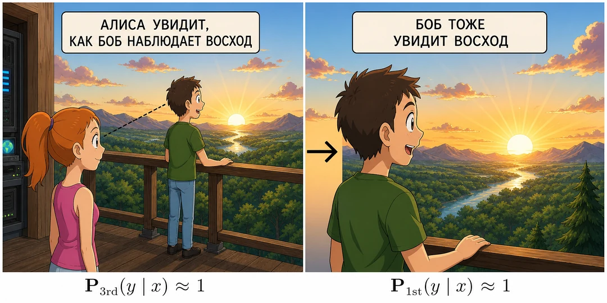

Алгоритмический идеализм действительно предсказывает $\mathbf{P}_{\rm 1st}\approx\mathbf{P}_{\rm 3rd}$ при условиях, которые, как ожидается, выполняются для обычных наблюдателей в повседневной жизни. В этом смысле он предсказывает возникновение объективной реальности. Вот почему. В силу постулата 2 величина $\mathbf{P}_{\rm 1st}$ в точности совпадает с результатом универсального метода индукции $M$. Подобно примеру с Землёй, если $x$ содержит достаточно данных — представьте довольно точное описание всех функционально существенных деталей мозга вашего друга Боба, — хороший метод индукции должен извлечь из них исчерпывающее описание всех релевантных физических законов мира $W$ и фактов среды Боба$_{\rm 3rd}$. Следовательно, он должен предсказать, что это состояние «я» эволюционирует так, словно встроено в мир $W$. Иными словами, индуктивный вывод должен дать предсказания, приближённо совпадающие с $\mathbf{P}_{\rm 3rd}$. Поэтому согласно [постулату 2](#Postulate2) происходящее с Бобом *с его собственной точки зрения* — по $\mathbf{P}_{\rm 1st}$ — согласуется с $\mathbf{P}_{\rm 3rd}$: в этом смысле вы разделяете с Бобом мир $W$.

**В битовой модели правильность этого рассуждения действительно является теоремой.** Эволюция состояния «я» вашего друга Боба в мире $W$ задаётся $\mathbf{P}_{\rm 3rd}$ — вычислимой мерой, поскольку мир $W$ вычислим. Поэтому из некоторого варианта уравнения $\eqref{eq2}$ следует, что алгоритмическая вероятность — точнее, её нормированная версия $\mathbf{P}_{\rm 1st}$ — с вероятностью один относительно мира сходится к ней в пределе, когда Боб узнаёт всё больше битов.

Возвращаясь к вопросу в начале подраздела, этот результат говорит, что алгоритмический идеализм не следует считать солипсистским. Если Алиса указывает на некоторый фрагмент материи или структуру, кодирующую в её мире состояние «я» $x$, во многих случаях она может заключить, что в этой структуре в некотором смысле «действительно кто-то есть». При $\mathbf{P}_{\rm 1st}\approx\mathbf{P}_{\rm 3rd}$ вероятностная эволюция структуры в мире Алисы по $\mathbf{P}_{\rm 3rd}$ верно представляет эволюцию перспективы первого лица некоторого Боба по $\mathbf{P}_{\rm 1st}$ — даже когда Алиса с этой структурой взаимодействует.

Формально вопрос «сколько существует агентов?» — один, много, бесконечно много — в алгоритмическом идеализме не определён. Фундаментальны и строго определены лишь состояния «я» и вероятностные переходы между ними, тогда как «агент» или «я» — прагматические и расплывчатые термины, лишь иногда работающие ожидаемым образом. Более того, алгоритмический идеализм отвергает саму метафизическую основу обвинения в солипсизме. С этой точки зрения существует бесконечно много состояний «я» и все они, несомненно, существуют математически, но «физическое существование» не является осмысленным свойством, которым состояние могло бы обладать или не обладать. Это не отменяет тривиального факта, что конкретный наблюдатель видит в своём эмерджентном внешнем мире лишь некоторые из них. Поэтому алгоритмический идеализм отвергает основание употребления слова «существуют» в вопросе «Существуют ли другие сознания?». Но наиболее близкий по духу ответ на этот формально неопределённый вопрос таков: в некотором смысле алгоритмический идеализм предполагает существование всех возможных сознаний и потому является максимально несолипсистским.

## 6.4. …и её ограничения: вероятностные подменыши и больцмановские мозги

Результат предыдущего подраздела зависит от важного предположения: состояние «я» другого агента, Боба, достаточно сложно, чтобы универсальная индукция вывела из него вероятностный мир Алисы *W*, который тем самым становится и миром Боба. Если это не так — в частности, если в битовой модели $K(x)\ll K(\mathbf{P}_{\rm 3rd})$, где $x$ — текущее состояние «я» Боба, см.[^83], — то в общем случае $\mathbf{P}_{\rm 1st}(y|x)\not\approx \mathbf{P}_{\rm 3rd}(y|x)$. Возникает чрезвычайно контринтуитивное явление: агент становится *вероятностным подменышем*[^84]. В средневековых европейских суевериях подменышем называли младенца, которого демоническое существо подкладывало молодой матери вместо её ребёнка, чтобы досаждать и вредить людям: мать *считала*, что дома находится её дитя, но *в действительности* там было иное существо. Следующий пример покажет, почему эта мрачная и ограниченная аналогия всё же уместна.

Как и прежде, допустим, что вы сейчас эффективно встроены в простой вероятностный мир *W* — читая эти строки, вы, вероятно, именно в нём и находитесь. Но на дворе 2178 год, и в нашем распоряжении научно-фантастическая технология: настольный компьютер симулирует другой простой вероятностный мир $W'$, где возник разум. Некоторое время вы наблюдаете за одним из симулированных существ, которого называете Чарли$_{\rm 3rd}$. Вы знаете, что закодированное в нём мгновенное состояние «я» $x$ достаточно сложно, чтобы универсальный метод индукции вывел из него мир $W'$[^85]. Поэтому вы заключаете: *тот, кто является этим состоянием «я»* — неформально вы называете агента Чарли$_{\rm 1st}$, хотя знаете, что в алгоритмическом идеализме нет фундаментального понятия агента, — *действительно продолжит переживать мир $W'$*. Формально $\mathbf{P}_{\rm 1st}(y|x)\approx \mathbf{P}_{\rm 3rd}(y|x)$. Иными словами, Чарли$_{\rm 3rd}$ точно представляет Чарли$_{\rm 1st}$; в этом смысле Чарли$_{\rm 1st}$ «действительно находится» в симуляции.

Теперь вы совершаете злонамеренный поступок: вмешиваетесь в симуляцию и произвольно заменяете некоторые черты окружения Чарли. Например, помещаете рядом с её домом гигантского розового симулированного кролика в скафандре, происхождение которого никто внутри симуляции объяснить не может. Это радикально меняет будущие вероятности $\mathbf{P}_{\rm 3rd}$ для Чарли$_{\rm 3rd}$ — например, теперь велика вероятность, что вскоре она проявит крайнее удивление. Но вмешательство не может изменить вероятности $\mathbf{P}_{\rm 1st}$, которые продолжат определять будущее Чарли$_{\rm 1st}$: они зависят только от оставленного вами нетронутым состояния «я» $x$. В некотором смысле вы заменили простой мир $W'$ на своём столе другим, гораздо более алгоритмически сложным миром $W''$, однако Чарли$_{\rm 1st}$, вероятно, продолжит переживать жизнь в $W'$. Вы по-прежнему наблюдаете Чарли$_{\rm 3rd}$ в симуляции, но дорогой вам Чарли$_{\rm 1st}$ больше нет: её сменил маловероятный Подменыш$_{\rm 1st}$, теперь реализованный в Чарли$_{\rm 3rd}$.

Вам может стать грустно: Чарли$_{\rm 1st}$ вам нравилась, а теперь исчезла. Но ошибочно считать Подменыша$_{\rm 1st}$ чем-то вроде бессознательного зомби. Если вы считали Чарли$_{\rm 1st}$ сознательной, нет оснований сомневаться в сознательности Подменыша$_{\rm 1st}$. Она будет совершенно уверена, что её прошлое верно описывается прежней Чарли$_{\rm 3rd}$, и потому почувствует себя законной преемницей Чарли$_{\rm 1st}$, какой вы знали её до появления злонамеренного кролика. Просто агент, случайно блуждающий по состояниям «я», реже попадает в мир $W''$, поскольку тот алгоритмически сложнее: это менее проторённая тропа в вычислимом пространстве возможностей. Мы получаем контринтуитивную ситуацию, где шансы событий сильно зависят от агента, а само понятие «агента» растворяется ещё загадочнее, чем, скажем, в эвереттовской квантовой теории. Но при всей контринтуитивности явление математически непротиворечиво.

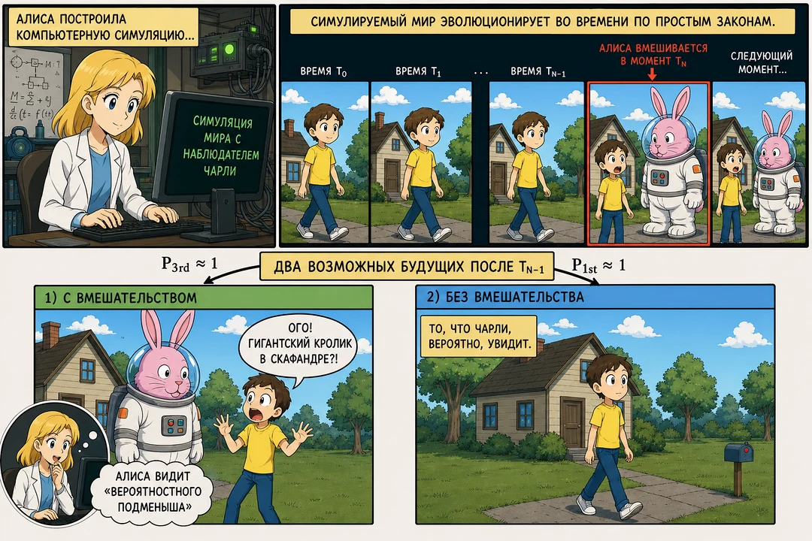

Это странное явление лежит в основе разрешения алгоритмическим идеализмом экзотических загадок вроде проблемы больцмановского мозга. Математически и информационно-теоретически подробный разбор проблемы в битовой модели дан в[^86], а её связь с ограничением A — в[^87]. Здесь мы лишь наметим основную идею, применимую, по ожиданию, ко всем моделям алгоритмического идеализма. Пусть мир *W*, в который вы случайно оказались эффективно встроены, действительно комбинаторно огромен, и вы знаете, что больцмановских мозгов в нём намного больше, чем обычных. Рассмотрим обычный мозг ОМ и больцмановский мозг БМ, оба кодирующие ваше текущее состояние «я» *x*. Согласно алгоритмическому идеализму, говорить «я — ОМ» или «я — БМ» было бы категориальной ошибкой: вы и есть состояние «я» $x$, а оно реализовано или представлено и в ОМ, и в БМ. Независимо от происходящего с каждым из них, происходящее с *вами* характеризуется $\mathbf{P}_{\rm 1st}(y|x)$. Перспектива третьего лица говорит, что в ближайшем будущем ОМ и БМ эволюционируют в мире *W* совершенно по-разному: $\mathbf{P}_{\rm 3rd}^{\rm OB}(y|x)\not\approx \mathbf{P}_{\rm 3rd}^{\rm BB}(y|x)$. Значит, обе вероятности не могут одновременно быть приближённо равны $\mathbf{P}_{\rm 1st}(y|x)$, и обычный, больцмановский либо оба мозга должны стать вероятностными подменышами.

Подменышем станет именно больцмановский мозг, тогда как $\mathbf{P}_{\rm 1st}(y|x)\approx\mathbf{P}_{\rm 3rd}^{\rm OB}(y|x)$. Явная техническая демонстрация для битовой модели приведена в[^88]. Интуитивная причина вновь связана с [постулатом 2](#Postulate2): следующим с вами произойдёт то, что предсказал бы универсальный метод индукции. Индуктивный вывод склонен продолжать в будущее регулярности текущего состояния «я» — возможно, содержащиеся в памяти о множестве прошлых наблюдений, — включая паттерн, согласно которому вы будто бы находились в низкоэнтропийной планетоподобной среде с мириадами закономерностей. В битовой модели $\mathbf{P}_{\rm 1st}(y|x)$ — версия алгоритмической вероятности, и её большое значение, по существу, означает, что для вычисления $y$ из $x$ требуется мало алгоритмической информации, независимо от числа экземпляров или копий $x$ во внешнем мире, выводимом из $x$.

Итак, даже если у вас есть основания считать, что во внешнем мире больцмановских мозгов намного больше обычных, следующим с вами, скорее всего, произойдёт то, чего вы ожидали бы, считая себя обычным, а не больцмановским мозгом. Как объяснялось выше, вопрос *«Обычный я мозг или больцмановский?»* в буквальном виде лишён смысла: вы — состояние «я», а не одна из его реализаций. Однако алгоритмический идеализм предсказывает, что будущий опыт с подавляющей вероятностью подтвердит «обычную жизнь на Земле», а не фантасмагорию больцмановского мозга — независимо от фактического *числа* больцмановских мозгов во Вселенной.

## 7. Пример: как следует рассуждать о гипотезе симуляции

Кажется, что следующие пять положений вместе влекут вывод: вы, вероятно, находитесь в симуляции.

1. Сознательные разумы можно симулировать.
2. Технологический прогресс в обозримом будущем не остановится.
3. Многие развитые цивилизации не уничтожат себя.
4. Многие развитые цивилизации захотят запускать симуляции.
5. Если симулированных существ гораздо больше, чем несимулированных, то вы, вероятно, симулированы.

Аргумент в пользу этого вывода хорошо известен[^89], и я не стану повторять его здесь. Для нас он важен потому, что физикалисту совершенно неясно, какое из положений следует отвергнуть, чтобы избежать заключения.

Гипотеза симуляции похожа на гипотезу больцмановского мозга. В последней набор правдоподобных физических предположений приводит к выводу, что большинство разумов — больцмановские мозги; в первой набор правдоподобных технологических предположений приводит к выводу, что большинство разумов симулированы. Может показаться, что второй вывод не так уж трудно принять[^90]. Но в действительности он вызывает проблемы, сходные с первым[^91]: самые распространённые симуляции могут оказаться теми, которые внезапно и неожиданно выключают.

Неясно, какое из пяти положений отклонить. С традиционной физикалистской точки зрения трудно отрицать положение 5: оно будто бы основано на вполне невинном принципе безразличия. Ещё сложнее отрицать положение 4: даже если некоторые потомки, получив возможность, откажутся симулировать сознательные разумы, многие наверняка всё равно станут это делать. Отрицание положений 3 или 2 выглядит чрезвычайно пессимистично. Остаётся положение 1. Некоторые действительно отвергают его, утверждая, что сознание основано на биологии и потому не может быть реализовано в кремнии[^92]. Но это позиция меньшинства, противоречащая как функционализму в философии сознания, так и влиятельным нейронаучным теориям — теории глобального рабочего пространства и теории интегрированной информации.

Оценка связанных с технологиями положений 2, 3 и 4 в алгоритмическом идеализме не отличается от традиционной физикалистской. Но что насчёт положения 1? Для ответа введём ещё одно:

1’. Сознательные разумы могут появляться путём биологического рождения.

Алгоритмический идеализм утверждает:

> Положения 1 и 1’ имеют одинаковые значения истинности. В частности, при правильном понимании терминов оба истинны.

Традиционные физикалисты, одновременно придерживающиеся функционализма сознания, вероятно, согласятся. Однако причины, по которым эти исследователи и алгоритмические идеалисты объявят 1 и 1’ эквивалентными, будут *разными*.

> **Физикалист и функционалист:** «Биологическое рождение» и «запуск симуляции» — события, которые *порождают* сознательное существо. Они являются материальными причинами того, что данный конкретный экземпляр сознания действительно появляется в данном месте и времени Вселенной; без этого конкретного или очень похожего события данное сознательное существо никогда не существовало бы.
>
> Поскольку биологический и симулированный разумы функционально эквивалентны, нет оснований предполагать истинность 1’ при ложности 1.

> **Алгоритмический идеалист:** вы и есть своё состояние «я», а если вы сознательны, сознательность — свойство этого состояния. Поэтому все состояния «я», заслуживающие называться «сознательными», существуют как математические структуры — как существуют и все бессознательные — и переходят друг в друга согласно [постулату 2](#Postulate2), *независимо от их актуализации в нашем мире*. «Рождение» и «запуск симуляции» не *создают* состояние «я», а создают материальные условия, которые его *представляют*.
>
> Если $x$ не является вероятностным подменышем (см. [раздел 6](#Section6)), в некотором смысле верно сказать, что созданные материальные условия ввели в наш мир экземпляр сознания. Но понимать это следует не как «создание» сознательного существа, которое иначе не существовало бы, а как появление условий, позволяющих «разделить с ним мир». Последствия рождения или запуска симуляции структурны: все вероятности происходящего с материальными условиями, представляющими $x$, — $\mathbf{P}_{\rm 3rd}(y|x)$ — теперь очень близки к вероятностям происходящего с $x$ в его частной перспективе — $\mathbf{P}_{\rm 1st}(y|x)$.

Таким образом, алгоритмические идеалисты и физикалисты-структуралисты согласны с истинностью положения 1, хотя понимают его смысл по-разному.

Наконец, что сказать о положении 5? Здесь между двумя лагерями возникает разногласие — по причинам, сходным с проблемой больцмановского мозга. Начнём с того, почему физикалисты могут считать 5 истинным, хотя, стремясь к последовательности, возможно, не должны.

Рассмотрим Вселенную, где доминируют симуляции, то есть симулированных сознательных существ гораздо больше, чем биологических. Физикалисты скажут, что этим исчерпываются физические факты, а все осмысленные убеждения — это убеждения о фактах мира. Но тогда почти по определению физика не может сказать, *во что вам следует верить* относительно принадлежности к одному из двух типов: перед нами экземпляр *ограничения A* из [раздела 3](#Section3). В некоторых термодинамических ситуациях принципы безразличия приводят к эмпирически успешным предсказаниям и выглядят интуитивно правдоподобно; можно развести руками и сослаться на максимальную энтропию, симметрию или что-либо ещё. Физикалист мог бы обратиться к таким аргументам либо просто к ощущению, что полное незнание — лучший вариант, если вы *вынуждены* во что-то верить, хотя вообще-то не должны. Отсюда вывод: если во Вселенной доминируют симуляции, вам следует считать себя частью симуляции.

Алгоритмический идеализм не согласен — примерно по тем же причинам, что и в проблеме больцмановского мозга. Прежде всего он отрицает осмысленность утверждения *«На самом деле я содержусь в симуляции»* как фактического тезиса. Вы — состояние «я» $x$ и фундаментально *никуда не встроены*, хотя $x$ представлено во множестве возможных вычислимых миров и множестве работающих в них симуляций.

Однако подходящая операционализация этого утверждения *в некоторых случаях* осмысленна. Какое из представлений состояния «я» $x$, если таковое имеется, точнее отслеживает ваши реальные вероятности от первого лица? Можно сравнить два возможных сценария, неформально описываемых так — хотя алгоритмический идеализм предупреждает, что не следует понимать эти формулировки слишком буквально:

- вы продолжите как обычно переживать то, что считаете «базовой реальностью»; шире — полное состояние «я», включая бессознательные аспекты, будет вероятностно эволюционировать так же, как в базовой реальности;
- через несколько секунд вы получите необычный опыт, указывающий на симуляцию. Например, Луна внезапно исчезнет, а вместо неё возникнет лицо странного существа, которое рассмеётся и объяснит, что вы находитесь в симуляции, созданной им.

Алгоритмический идеализм позволяет сравнить вероятности этих сценариев: вероятнее то, что предсказывает индукция, *независимо от числа насчитанных представлений*. Между двумя конкретными вариантами первый вероятнее. То же рассуждение применимо не только к отдельному удивительному событию, подобному описанному, но и к *общему* событию любого отклонения от базовой реальности, которое также предсказывается как маловероятное. Конечно, этот интуитивный вывод нужно строго доказать в конкретной математической модели алгоритмического идеализма. Расчёт для больцмановского мозга в[^93] должен подсказать, как сделать это в битовой модели.

Итак, **алгоритмический идеализм отвергает положение 5**: даже если симулированных существ намного больше несимулированных, отсюда не следует, что вы, вероятно, симулированы. Важно не число реализаций, а предсказание универсального метода индуктивного вывода на основе текущего состояния «я». Это не просто *эпистемическое* утверждение — описание результата какого-то метода индукции, — а *закономерный* тезис: в будущем вы *на самом деле, вероятно,* не увидите ничего необычного, указывающего на симуляцию.

Важно, что без дополнительных оговорок алгоритмический идеализм *не утверждает*, будто вы, вероятно, не симулированы. Например, он не видит онтологического различия между двумя тезисами:

1. Вы продолжаете переживать базовую реальность, потому что действительно встроены в неё.
2. Вы продолжаете переживать базовую реальность, потому что встроены в её очень точную симуляцию.

Согласно алгоритмическому идеализму, вы *никуда не встроены*, поэтому оба утверждения одинаково бессмысленны: в их формулировках содержится категориальная ошибка. Ни одно из них нельзя считать «более правильным».

Напомним: алгоритмический идеализм предсказывает, что агенты часто обнаруживают себя *эффективно встроенными* в некоторый вычислимый мир $W$: предположение о встроенности точно отслеживает шансы от первого лица. Возможно, ваше состояние «я» представлено в $W$ внутри того, что можно назвать работающей в $W$ компьютерной симуляцией. Но если эта симуляция — назовём её $W'$ — *изолирована*, то есть была запрограммирована и продолжает работать без внешнего вмешательства, одинаково верно считать себя встроенным в самостоятельный мир $W'$ — без мира $W$ и запускающего её компьютера. Поэтому осмысленный случай эффективной встроенности *именно в симуляцию* возникает только тогда, когда симуляция не изолирована и информация из внешнего мира $W$ просачивается внутрь — например, через вмешательства. Это различие и дополнительные следствия для симуляции агентов, включая поднятые Бостромом[^94] этические вопросы, подробнее обсуждаются в[^95].

В заключение вернёмся к замечанию в начале раздела, выражавшему особое опасение: самые распространённые симуляции могут внезапно и неожиданно выключать. Разве это не указывает на фундаментальное различие между пунктами 1 и 2 выше? Алгоритмический идеализм отрицает такое различие. Вспомним пример с подменышем из [раздела 6](#Section6), где вы запускаете изолированную симуляцию мира $W'$, содержащую агента Чарли$_{\rm 3rd}$. Допустим, вы решаете её выключить. Тогда Чарли$_{\rm 3rd}$ — соответствующие пиксели на экране или паттерн в памяти компьютера — перестаёт существовать. Но вероятности будущих наблюдений $y$ Чарли$_{\rm 1st}$, $\mathbf{P}_{\rm 1st}(y|x)$, по существу[^96] не меняются: универсальный метод индукции из постулата 2 продолжит считать мир $W'$ наилучшим объяснением состояния «я» Чарли$_{\rm 1st}$, поэтому она продолжит переживать мир $W'$. Согласно алгоритмическому идеализму, выключение закрытой симуляции не «убивает» её обитателей, а практически не затрагивает их. Интуитивно ваша симуляция больше похожа на «фильм», чем на «зоопарк», и её уничтожение не влияет на героев. Для любителей научной фантастики здесь есть забавная параллель с «теорией пыли» из *«Города перестановок»* Грега Игана[^97].

## 8. Выводы

Я представил подход к основаниям физики, предварительно названный алгоритмическим идеализмом, который объявляет фундаментальной перспективу первого лица. Основным становится вопрос «Что, вероятно, произойдёт со мной дальше?», а не «Что имеет место в мире?». Несмотря на название, понятия высокого уровня — агент, сознание, убеждение — не играют фундаментальной роли. Два постулата допускают несколько строгих математических формализаций, то есть класс конкретных теорий. Одна предварительная формализация — битовая модель — была представлена в более ранней работе[^98], где также содержатся формальные доказательства многих изложенных здесь концептуальных ожиданий: эмерджентного — не точного, но весьма хорошего — возникновения простого, вероятностного и вычислимого внешнего мира, в который агент кажется встроенным, и понятия объективной реальности; снятия загадок больцмановского мозга, телетранспортации Парфита и компьютерной симуляции агентов; новых явлений вроде вероятностных подменышей, предполагающих особую зависимость фактов и их правдоподобия от агента[^99].

По построению предсказания алгоритмического идеализма согласуются с физическими теориями в стандартных лабораторных ситуациях, если верна подходящая физическая версия тезиса Чёрча — Тьюринга. Сам алгоритмический идеализм построен в духе эмпиризма: он не стремится напрямую узнать что-либо об онтологии мира и попутно разрушает практически все человеческие метафизические предубеждения — точнее, объявляет их лишь полезными моделями, иногда приближённо дающими верный ответ. Подход не спрашивает, каков мир; его единственная цель — правильно описать явления. В этом смысле он призван минимально расширить обычную методологию физики на новую область: перейти от *интерсубъективных экспериментов*, о результатах которых может узнать каждый, к *частным экспериментам*, для которых перспектива третьего лица или предсказание «извне» принципиально недоступны.

Одна лишь *возможность* — пусть и маловероятная, — что некоторые черты алгоритмического идеализма ближе к истине, чем стандартная картина, указывает на поразительную нехватку воображения в нашем отношении к важнейшим вопросам человечества. Следует ли человечеству колонизировать Галактику, чтобы сделать возможным множество сознательных жизней, которые иначе не существовали бы[^100]? Аргументы «за» обычно неявно предполагают метафизику «единственного реального мира среди бесконечно многих возможных», уже критиковавшуюся Льюисом[^101] и отвергаемую алгоритмическим идеализмом. Прекращает ли выключение компьютерной симуляции существование симулированных сознательных существ[^102]? Обычно утвердительный ответ принимается как самоочевидный, но алгоритмический идеализм утверждает, что в общем случае это неверно: всё зависит от объёма информации, поступающей в симуляцию из внешнего мира. Но если мы не понимаем, что говорить о симуляции агентов, почему так уверены, что понимаем смерть — вспомните [раздел 1](#Section1)? Возможно, переход в бессознательное «безмолвное состояние» бесконечной длительности кажется нам единственной научно правдоподобной возможностью лишь потому, что все известные альтернативы пропагандировали псевдодуховную бессмыслицу и религиозное принятие желаемого за действительное, а мы хотим продемонстрировать серьёзность и надёжность, вовсе не затрагивая вопрос.

Эти примеры также показывают, что алгоритмический идеализм — не просто теория о том, как агентам лучше предсказывать будущие наблюдения, а радикально новый подход к физической реальности. Будь это всего лишь разновидность эпистемологии, *фактическая судьба* агента определялась бы, как правило, неизвестным физическим миром, в котором тот действует. Алгоритмический идеализм, напротив, отрицает фундаментальную встроенность агента в какой-либо мир и основывает всё происходящее с ним исключительно на состоянии «я». Эта контринтуитивная исходная точка позволяет сформулировать закон — постулат 2, — призванный определять судьбу агента и в обыденных, и в действительно экзотических ситуациях вроде симуляции и размножения; отсюда следуют контринтуитивные предсказания: агент может «выпасть» из мира, в который эффективно и приближённо встроен, или стать вероятностным подменышем. В эпистемическом подходе такие предсказания не просто невозможно *получить* — как показало ограничение A, утверждения о мире от третьего лица ничего не говорят о шансах от первого лица в сценариях дублирования, — они *прямо противоречат* предположению, что агент встроен в некоторый данный, но неизвестный мир. Здесь проходит и чёткая граница с *операциональными теориями*[^103] в обычной формулировке квантовой теории информации. В них тоже присутствуют агенты и их наблюдения — например, Алиса и Боб в сценарии связи, — но предполагается, что агенты встроены в общую физическую систему, внешний мир, опосредующий их связь и наблюдения. В алгоритмическом идеализме внешний мир не постулируется априори, а возникает как статистическое явление — вместе с интуитивной идеей о том, что Алиса и Боб разделяют *один и тот же* физический мир.

Итак, алгоритмический идеализм не создавался с намерением напрямую сказать что-либо о реальности. Но методологический отказ от привычных реалистских предпосылок привёл к формулировке, допускающей новые, иначе недоступные предсказания и одновременно несовместимой с унаследованной картиной физической реальности. Тем самым она отличается от существующих эпистемических и операциональных подходов.

Перед алгоритмическим идеализмом стоят две главные взаимосвязанные технические задачи. Во-первых, битовую модель из[^104] необходимо заменить лучшей математической формализацией; работа над ней продолжается. По существу битовая модель исключает возможность «забывания» — немотивированное и нереалистичное следствие исторически сложившейся формулировки индукции Соломонова в АТИ.

Во-вторых, успешная формализация должна предсказывать некоторые феноменальные черты квантовой теории. Как объяснялось в [разделе 2](#Section2), квантовая теория — одна из главных мотиваций алгоритмического идеализма. Более того, если вероятности событий фундаментально зависят от агента, это уже напоминает явление, иногда считающееся по-настоящему квантовым, — например, в расширенном сценарии друга Вигнера[^105] из [раздела 3](#Section3). Это также намекает, что в итоговом описании внешнего мира агента не все потенциальные события могут укладываться в одно совместное колмогоровское распределение вероятностей — фундаментальный структурный элемент квантовой теории[^106], необходимый, хотя и недостаточный, для многих её явлений. Главной целью должна стать *реконструкция*[^107] действительно квантовых явлений: нарушения неравенств Белла при одновременном соблюдении принципа запрета передачи сигналов[^108] или возможности за полиномиальное время выполнять BQP-полные вычисления[^109]. Возможное объяснение первого явления в моделях алгоритмического идеализма, допускающих забывание, намечено в[^110] и показано на рисунке 4, но требует дальнейшей разработки. Недостаточно, как делают некоторые подходы, указать на математические элементы — комплексные числа, «волновые функции», уравнения эволюции, — похожие на элементы квантовой теории. Главный вопрос в том, предсказывается ли действительно неклассическое поведение *статистических результатов экспериментов*, и любое утверждение по этой теме должно учитывать выводы исследований оснований квантовой теории. Способность или неспособность предсказывать квантовые черты — важная возможность проверить алгоритмический идеализм; уже поэтому было бы методологически неверно встраивать квантовый формализм в него по построению.

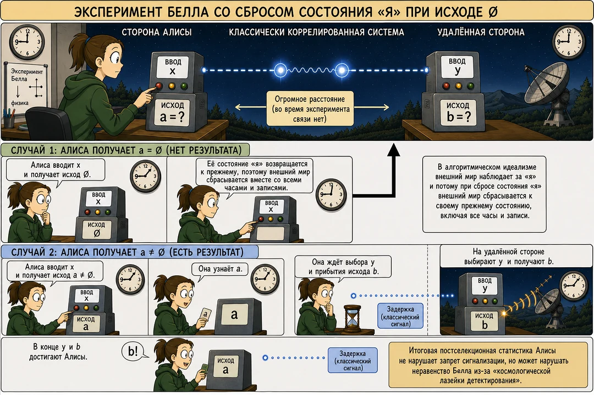

**Рисунок 4.** Набросок того, как алгоритмический идеализм естественно предсказывает не допускающую передачи сигналов, но нарушающую неравенство Белла статистику $P(a,b|x,y)$, если эмерджентный внешний мир обладает структурой локальности, позволяющей определить эксперимент Белла. Это описано в[^111]. Основная идея: внешний мир в конечном счёте супервентен на состоянии «я», что при «стирании» информации этого состояния имеет неожиданные статистические последствия — например, если вероятность стирания коррелирует с удалённой случайной величиной. Получившееся явление напоминает предложение Хью Прайса объяснять белловские корреляции артефактами отбора[^112]. Но чтобы действительно получить такое предсказание алгоритмического идеализма, сначала необходимо решить описанную в FAQ «проблему отсутствия стирания».

---

Дальнейшей разработки требуют и некоторые другие элементы алгоритмического идеализма. Простой пример — ссылка на «физический тезис Чёрча — Тьюринга»: что именно предполагается о вычислимости физического мира? Чтобы гарантировать согласованность алгоритмического идеализма с физикой, достаточно утверждения, *гораздо* более слабого, чем тезис Цузе[^113], и даже более слабого, чем версия Дойча[^114]: метод индукции $M$, используемый в формализации постулата 2, должен быть успешен в нашем физическом мире. В битовой модели $M$ — индукция Соломонова. Коротко говоря, для её успеха нужен алгоритм, который по описанию эксперимента с дискретными исходами вычисляет вероятности всех возможных результатов. Это кажется довольно безобидным предположением, не требующим ни дискретности, ни детерминированности физического мира. Однако детали ещё предстоит проработать, а применимость к современным теориям — тщательно проверить, помня, что при изменении формализации постулата 2 изменится и метод индукции.

В эпилоге вернёмся к сценарию [раздела 1](#Section1). Что ответить на отчаянный вопрос пациента при маловероятном предположении истинности алгоритмического идеализма? «Проснётся» ли он в компьютерной симуляции? Мы не знаем ни состояния «я» пациента, ни деталей симуляции и даже не выбрали конкретную формализацию постулатов 1 и 2, поэтому можем предложить лишь практический ответ, основанный на общих принципах. Вы и есть своё состояние «я», и, чтобы быть «бодрствующим», вам необязательно реализовываться в материальном объекте того, что сейчас переживается как внешний мир. Так что да — возможно, вы переживёте симулированную среду. Но она должна быть *алгоритмически простой*, иначе переход маловероятен: сложный райский мир, специально подогнанный под ваши желания, скорее всего, не сработает. Возможно, деньги вообще не стоило тратить: симулированный мир существует математически независимо от действий AfterMath. По крайней мере вам не нужно платить компании за то, чтобы она впоследствии не выключала симуляцию. Более конкретный ответ потребовал бы подробной математической модели алгоритмического идеализма и гораздо большей работы.

Поэтому практический ответ, пожалуй, сводится к двум словам: *не теряйте надежды*.

## Благодарности

Я благодарен [Келвину Маккуину](https://kelvinmcqueen.com) за многочисленные полезные и вдохновляющие обсуждения, особенно за его ранний вклад в то, что стало [разделом 7](#Section7) этой статьи. Я также благодарю [Майкла Каффаро](https://www.michaelcuffaro.com) за ценные замечания к ранней версии.

## Литература

- N. Bostrom, *The Fable of the Dragon-Tyrant*, [J. Med. Ethics **31**, 273 – 277](https://doi.org/10.1136/jme.2004.009035) (2005), [copy on author’s homepage](https://nickbostrom.com/papers/the-fable-of-the-dragon-tyrant/).
- M. P. Müller, *Law without law: from observer states to physics via algorithmic information theory*, [Quantum **4**, 301](https://doi.org/10.22331/q-2020-07-20-301) (2020).
- C. L. Jones and M. P. Müller, *On the significance of Wigner’s Friend in contexts beyond quantum foundations*, [Quantum **10**, 2147](https://doi.org/10.22331/q-2026-06-30-2147) (2026).
- G. M. D’Ariano and F. Faggin, *Hard Problem and Free Will: An Information-Theoretical Approach*, in Scardigli, F. (ed.), *Artificial Intelligence Versus Natural Intelligence* Springer, Cham, 2022; [arXiv:2012.06580](https://doi.org/10.48550/arXiv.2012.06580).
- P. Berghofer, *Quantum Probabilities Are Objective Degrees of Epistemic Justification*, [arXiv:2410.19175](https://doi.org/10.48550/arXiv.2410.19175).
- A. Chakravartty, *Scientific Realism*, [The Stanford Encyclopedia of Philosophy](https://plato.stanford.edu/archives/sum2017/entries/scientific-realism/) (Summer 2017 Edition), Edward N. Zalta (ed.).
- A. Sokal and J. Bricmont, *Fashionable Nonsense: Postmodern Intellectuals’ Abuse of Science*, New York, Picador, 1999.
- L. Catani, M. Leifer, G. Scala, D. Schmid, and R. W. Spekkens, *What is Nonclassical about Uncertainty Relations?*, Phys. Rev. Lett. **129**, 240401 (2022); [arXiv:2207.11779](https://doi.org/10.48550/arXiv.2207.11779).
- W. Wootters and W. Zurek, *A Single Quantum Cannot be Cloned*, [Nature **299**, 802–803](https://doi.org/10.1038/299802a0) (1982).
- A. Peres, *Quantum theory: concepts and methods*, Kluwer Acad. Publ., Dordrecht, 2010.
- H. Everett, *The Theory of the Universal Wave Function*, 1956, in B. S. DeWitt and N. Graham (eds.), *The Many-Worlds Interpretation of Quantum Mechanics*, Princeton University Press, Princeton, 1973, [Calisphere link](https://calisphere.org/item/ark:/81235/d8kp7v50b/).
- D. Dürr, S. Goldstein, T. Norsen, W. Struyve, and N. Zanghì, *Can Bohmian mechanics be made relativistic?*, [Proc. R. Soc. A **470**, 20130699](https://doi.org/10.1098/rspa.2013.0699) (2014); [arXiv:1307.1714](https://doi.org/10.48550/arXiv.1307.1714).
- G. Ghirardi and A. Bassi, *Collapse Theories*, [The Stanford Encyclopedia of Philosophy](https://plato.stanford.edu/archives/fall2024/entries/qm-collapse/) (Fall 2024 Edition), E. N. Zalta & U. Nodelman (eds.).
- R. W. Spekkens, *In defense of the epistemic view of quantum states: a toy theory*, [Phys. Rev. A **75**, 032110](https://doi.org/10.1103/PhysRevA.75.032110) (2007); [arXiv:quant-ph/0401052](https://doi.org/10.48550/arXiv.quant-ph/0401052).
- L. Hausmann, *A consolidating review of Spekkens’ toy theory*, [arXiv:2105.03277](https://doi.org/10.48550/arXiv.2105.03277).
- L. Catani, M. Leifer, D. Schmid, R. W. Spekkens, *Why interference phenomena do not capture the essence of quantum theory*, [Quantum **7**, 1119](https://doi.org/10.22331/q-2023-09-25-1119) (2023).
- J. S. Bell, *On the Einstein Podolsky Rosen paradox*, [Physics **1**, 195](https://doi.org/10.1103/PhysicsPhysiqueFizika.1.195) (1964).
- C. J. Wood and R. W. Spekkens, *The lesson of causal discovery algorithms for quantum correlations: Causal explanations of Bell-inequality violations require fine-tuning*, [New J. Phys. **17**, 033002](https://doi.org/10.1088/1367-2630/17/3/033002) (2015).
- M. E. Cuffaro, *The Measurement Problem Is a Feature, Not a Bug –Schematising the Observer and the Concept of an Open System on an Informational, or (Neo-)Bohrian, Approach*, [Entropy **25**(10), 1410](https://doi.org/10.3390/e25101410) (2023).
- R. Healey, *Quantum Theory: a Pragmatist Approach*, [British J. Philos. Sci. **63**(4), 729–771](https://doi.org/10.1093/bjps/axr054) (2012); [arXiv:1008.3896](https://doi.org/10.48550/arXiv.1008.3896).
- Č. Brukner and A. Zeilinger, *Information and fundamental elements of the structure of quantum theory*, in “Time, Quantum, Information”, edited by L. Castell and O. Ischebeck (Springer, 2003); [arXiv:quant-ph/0212084](https://doi.org/10.48550/arXiv.quant-ph/0212084).
- J. Bub, *Bananaworld. Quantum Mechanics for Primates*, Oxford University Press, Oxford, 2016.
- C. Rovelli, *Relational quantum mechanics*, [Int. J. Theor. Phys. **35**, 1637](https://doi.org/10.1007/BF02302261) (1996); [arXiv:quant-ph/9609002](https://doi.org/10.48550/arXiv.quant-ph/9609002).
- E. Adlam, *Against Self-Location*, [Br. J. Phil. S](https://doi.org/10.1086/732908), [arXiv:2409.05259](https://doi.org/10.48550/arXiv.2409.05259).
- F. A. Fuchs, *Notwithstanding Bohr, the Reasons for QBism*, [Mind and Matter **15**(2), 245-300](https://www.ingentaconnect.com/contentone/imp/mm/2017/00000015/00000002/art00006) (2017); [arXiv:1705.03483](https://doi.org/10.48550/arXiv.1705.03483).
- S. M. Carroll, *Why Boltzmann brains are bad*, Current Controversies in Philosoph of Science, Routledge, 7–20 (2020); [arXiv:1702.00850](https://doi.org/10.48550/arXiv.1702.00850).
- A. Elga, *Defeating Dr. Evil with self-locating belief*, [Philos. Phenomenol. Res. **69**(2), 383–396](https://doi.org/10.1111/j.1933-1592.2004.tb00400.x) (2004); [copy on author’s homepage](https://www.princeton.edu/~adame/papers/drevil/drevil.pdf).
- D. Parfit, *Reasons and persons*, Oxford University Press, Oxford (1984).
- P. Walley, *Statistical Reasoning with Imprecise Probabilities*, Monographs on Statistics and Applied Probability, Springer Science and Business Media, 1991.
- T. Fritz and M. Leifer, *Plausibility measures on test spaces*, [arXiv:1505.01151](https://doi.org/10.48550/arXiv.1505.01151).
- N. Friedman and J. Y. Halpern, *Plausibility Measures: A User’s Guide*, in P. Besnard and S. Hanks (eds.), *Proceedings of the Eleventh Conference on Uncertainty in Artificial Intelligence (UAI1995)*, Morgan Kauffman, 1995.
- D. Frauchiger and R. Renner, *Quantum theory cannot consistently describe the use of itself*, [Nat. Commun. **9**, 3711](https://doi.org/10.1038/s41467-018-05739-8) (2018).
- J. Fankhauser, *Epistemic Boundaries and Quantum Uncertainty: What Local Observers Can (Not) Predict*, [Quantum **8**, 1518](https://doi.org/10.22331/q-2024-11-07-1518) (2024).
- J. Fankhauser, T. Gonda, and G. De les Coves, *Epistemic Horizons From Deterministic Laws: Lessons From a Nomic Toy Theory*, [Synthese **205**, 136](https://doi.org/10.1007/s11229-024-04852-0) (2015); [arXiv:2406.17581](https://doi.org/10.48550/arXiv.2406.17581).
- J. Szangolies, *Epistemic Horizons and the Foundations of Quantum Mechanics*, [Found. Phys. **48**, 1669](https://doi.org/10.1007/s10701-018-0221-9) (2018); [arXiv:1805.10668](https://doi.org/10.48550/arXiv.1805.10668).
- J. Barrett, L. Hardy, A. Kent, *No signaling and quantum key distribution*, [Phys. Rev. Lett. **95**, 010503](https://doi.org/10.1103/PhysRevLett.95.010503) (2005); [arXiv:quant-ph/0405101](https://doi.org/10.48550/arXiv.quant-ph/0405101).
- R. Colbeck, *Quantum and Relativistic Protocols For Secure Multi-Party Computation*, PhD Thesis, University of Cambridge, 2006; [arXiv:0911.3814](https://doi.org/10.48550/arXiv.0911.3814).
- S. Pironio, A. Acín, S. Massar, A. Boyer de la Giroday, D. N. Matsukevich, P. Maunz, S. Olmschenk, D. Hayes, L. Luo, T. A. Manning and C. Monroe, *Random numbers certified by Bell’s theorem*, [Nature **464**, 1021](https://doi.org/10.1038/nature09008) (2010); [arXiv:0911.3427](https://doi.org/10.48550/arXiv.0911.3427).
- J. B. DeBrota, C. A. Fuchs, and R. Schack, *Respecting One’s Fellow: QBism’s Analysis of Wigner’s Friend*, [Found. Phys. **50**, 1859–1874](https://doi.org/10.1007/s10701-020-00369-x) (2020); [arXiv:2008.03572](https://doi.org/10.48550/arXiv.2008.03572).
- H. Zwirn, *Are Events Absolute?*, [arXiv:2507.14672](https://doi.org/10.48550/arXiv.2507.14672).
- D. C. Dennett, *Real Patterns*, J. Philos. **88**(1), 27 (1991); [download link](https://ruccs.rutgers.edu/images/personal-zenon-pylyshyn/class-info/FP2012/FP2012_readings/Dennett_RealPatterns.pdf) at Rutgers Center for Cognitive Science.
- H. Kragh, *The first curved-space universe*, [Astron. Geophys. **53**(5), 5.13–5.15](https://doi.org/10.1111/j.1468-4004.2012.53513.x) (2012).
- T. M. Cover and J. A. Thomas, *Elements of Information Theory*, John Wiley & Sons, 2006.
- M. Hutter, *Universal Artificial Intelligence – Sequential Decisions Based on Algorithmic Probability*, Springer, Berlin, Heidelberg, 2005.
- M. Li and P. Vitányi, *Kolmogorov Complexity and Its Applications*, 3rd Edition, Springer, 2008.
- D. Deutsch, *Quantum theory, the Church-Turing principle and the universal quantum computer*, [Proc. R. Soc. (London) A **400**, 97–117](https://doi.org/10.1098/rspa.1985.0070) (1985); [download link](https://www.cs.princeton.edu/courses/archive/fall04/cos576/papers/deutsch85.pdf).
- S. Wolfram, *A New Kind of Science*, Champaign, Illinois, 2002.
- R. Gandy, *Church’s thesis and principles for mechanisms*, [Stud. Log. Found. Math. **101**, 123-148](https://doi.org/10.1016/S0049-237X(08)71257-6) (1980); [download link](https://cse.buffalo.edu/~rapaport/Papers/Papers.by.Others/gandy80.pdf).
- P. Arrighi and G. Dowek, *The physical Church-Turing thesis and the principles of quantum theory*, [Int. J. Found. Comput. S. **23**(5), 1131–1145](https://doi.org/10.1142/S0129054112500153) (2012); [arXiv:1102.1612](https://doi.org/10.48550/arXiv.1102.1612).
- D. R. Hofstadter, *Gödel, Escher, Bach: an eternal golden braid*, Basic Books, New York, 1979.
- G. Piccinini, *Computationalism, The Church-Turing Thesis, and the Church-Turing Fallacy*, [Synthese **154**(1), 97–120](https://doi.org/10.1007/s11229-005-0194-z) (2007); [JSTOR download](https://www.jstor.org/stable/pdf/27653444.pdf).
- N. Bostrom, *Superintelligence: Paths, Dangers, Strategies*, Oxford University Press, Oxford, 2014.
- D. C. Dennett, *Freedom Evolves*, Penguin Group, New York, 2003.
- G. Egan, *Permutation City*, Night Shade Books, 2014.
- D. Chalmers, *Reality+. Virtual Worlds and the Problems of Philosophy*, W. W. Norton, 2022.
- E. Schwitzgebel, *Let’s Hope We’re Not Living in a Simulation*, [Philos. Phenomenol. Res. **109**, 1042-1048](https://doi.org/10.1111/phpr.13125) (2024); [download preprint](https://www.faculty.ucr.edu/~eschwitz/SchwitzPapers/Simulation-240401c.pdf).
- B. Coecke and A. Kissinger, *Picturing Quantum Processes*, Cambridge University Press, Cambridge, 2017.
- K.-W. Bong, A. Utreras-Alarcón, F. Gharafi, Y.-C. Liang, N. Tischler, E. G. Cavalcanti, G. J. Pryde, and H. M. Wiseman, *A strong no-go theorem on the Wigner’s friend paradox*, [Nat. Phys. **16**, 1199–1205](https://doi.org/10.1038/s41567-020-0990-x) (2020).
- E. P. Wigner, *Remarks on the Mind-Body Question*, in [*Symmetries and Reflections*, 171–184,](https://doi.org/10.1007/978-3-642-78374-6_20) Indiana University Press, Bloomington, Indiana, 1967; [download link](https://www.informationphilosopher.com/solutions/scientists/wigner/Wigner_Remarks.pdf).
- N. Block, *Troubles with functionalism*, in C. W. Savage (ed.), *Perception and cognition: issues in the foundations of psychology*, University of Minnesota Press, Minneapolis, 1978.; [download link](https://web.ics.purdue.edu/~drkelly/BlockTroublesWithFunctionalism1980.pdf).
- J. Schmidhuber, *Algorithmic Theories of Everything*, Instituto Dalle Molle Di Studi Sull Intelligenza Artificiale (2000), [arXiv:quant-ph/0011122](https://doi.org/10.48550/arXiv.quant-ph/0011122).
- S. Lloyd, *Programming the Universe: A Quantum Computer Scientist Takes on the Cosmos*, Random House, New York, 2006.
- D. Lewis, *On the Plurality of Worlds*, Wiley-Blackwell, 2001.
- N. Bostrom, *Are We Living in a Computer Simulation?*, [Philos. Q. **53**(211), 243–255](https://doi.org/10.1111/1467-9213.00309) (2003); [copy on JSTOR](https://www.jstor.org/stable/3542867).
- T. Ord, *The Precipice. Existential Risk and the Future of Humanity*, Bloomsbury Publishing, 2020.
- A. Fine, *Hidden Variables, Joint Probability, and the Bell Inequalities*, [Phys. Rev. Lett. **48**, 291](https://doi.org/10.1103/PhysRevLett.48.291)(1982); [copy on author’s homepage](https://faculty.washington.edu/afine/PRL1982.pdf).
- M. P. Müller, *Probabilistic theories and reconstructions of quantum theory*, [SciPost Phys. Lect. Notes **28**](https://doi.org/10.21468/SciPostPhysLectNotes.28) (2021).
- L. Hardy, *Quantum theory from five reasonable axioms*, [arXiv:quant-ph/0101012](https://doi.org/10.48550/arXiv.quant-ph/0101012) (2001).
- B. Dakić and Č. Brukner, *Quantum theory and beyond: is entanglement special?*, [in *Deep Beauty: Understanding the Quantum World through Mathematical Innovation*](https://doi.org/10.1017/CBO9780511976971.011) (ed. H. Halvorson), Cambridge University Press, Cambridge, 2011; [arXiv:0911.0695](https://doi.org/10.48550/arXiv.0911.0695).
- L. Masanes and M. P. Müller, *A derivation of quantum theory from physical requirements*, [New J. Phys. **13**, 063001](https://doi.org/10.1088/1367-2630/13/6/063001) (2011); [arXiv:1004.1483](https://doi.org/10.1088/1367-2630/13/6/063001).
- G. Chiribella, G. M. D’Ariano, and P. Perinotti, *Informational derivation of quantum theory*, [Phys. Rev. A **84**, 012311](https://doi.org/10.1103/PhysRevA.84.012311) (2011); [arXiv:1011.6451](https://doi.org/10.48550/arXiv.1011.6451).
- J. Barrett, N. Linden, S. Massar, S. Pironio, S. Popescu, and D. Roberts, *Nonlocal correlations as an information-theoretic resource*, [Phys. Rev. A **71**, 022101](https://doi.org/10.1103/PhysRevA.71.022101) (2005); [arXiv:quant-ph/0404097](https://doi.org/10.48550/arXiv.quant-ph/0404097).
- H. Price, *Bell correlations and selection bias*, [arxiv:2605.00406](https://doi.org/10.48550/arXiv.2605.00406).
- S. Aaronson, *NP-complete problems and physical reality*, ACM SIGACT News **36**(1), 30–52 (2005); [arXiv:quant-ph/0502072](https://doi.org/10.48550/arXiv.quant-ph/0502072).
- K. Zuse, *Rechnender Raum*, Friedrich Vieweg u. Sohn, Wiesbaden, 1969; [download link](https://www.informationphilosopher.com/solutions/scientists/zuse/Rechnender_Raum.pdf).

Version 1.3 of July 2, 2026

[^1]: Эта история и большая часть дальнейшего изложения предполагают, что агентов — по крайней мере тех, о которых здесь идёт речь и которые в конечном счёте должны включать людей, — в принципе можно описать классически и, возможно, конечным объёмом классической информации. Это совместимо с тем, что некоторые биологические процессы являются подлинно квантовыми и/или непрерывными: можно интуитивно предположить, что столь тонкие детали несущественны для всего важного в нас как личностях, включая сознательный опыт, поскольку надёжное функционирование, по-видимому, исключает зависимость от слишком мелких деталей. Обоснованность предположения остаётся предметом современных дискуссий и обширной литературы о возможности «загрузки сознания». Недавний контраргумент, помещающий квантовые состояния в основу сознания: G. M. D’Ariano and F. Faggin, *Hard Problem and Free Will: An Information-Theoretical Approach*, in Scardigli, F. (ed.), *Artificial Intelligence Versus Natural Intelligence*, Springer, Cham, 2022; [arXiv:2012.06580](https://doi.org/10.48550/arXiv.2012.06580).

[^2]: N. Bostrom, *The Fable of the Dragon-Tyrant*, J. Med. Ethics **31**, 273-277 (2005); [copy on Bostrom’s homepage](https://nickbostrom.com/papers/the-fable-of-the-dragon-tyrant/).

[^3]: A. Chakravartty, *Scientific Realism*, [The Stanford Encyclopedia of Philosophy](https://plato.stanford.edu/archives/sum2017/entries/scientific-realism/) (Summer 2017 Edition), Edward N. Zalta (ed.).

[^4]: A. Sokal and J. Bricmont, *Fashionable Nonsense: Postmodern Intellectuals’ Abuse of Science*, New York: Picador, 1999.

[^5]: Во избежание недоразумений с самого начала подчеркну: **алгоритмический идеализм не задуман как новая интерпретация квантовой теории**. Это теория, нацеленная на конкретные предсказания там, где их сейчас не хватает — для «частных экспериментов» из [раздела 3](#Section3). Ради этого приходится отложить стандартные реалистские предпосылки и сосредоточиться на вопросе из заглавия. Квантовая физика служит дополнительной мотивацией. Цель — построить теорию и исследовать её, иногда крайне контринтуитивные, предсказания, а не исчерпывающе обсуждать философию квантовой теории, вероятности или все мотивирующие концептуальные позиции.

[^6]: Точнее, противоречие возникает при наличии конечного светоделителя, создающего идеальную деструктивную интерференцию, *если одновременно* наивно моделировать опыт смесью с вероятностями 1/2 двух реализаций, где частица детерминистически подготовлена соответственно в верхней или нижней ветви. Это методологическое наблюдение: самые прямолинейные эпистемические интерпретации обычно не объясняют результаты опыта. Придать наблюдению формальную строгость важно, но для этого требуется существенно больше работы — например, доказать, что никакая неконтекстуальная онтологическая модель не воспроизводит конкретную функциональную форму квантовых соотношений неопределённостей интерференционного эксперимента; см. L. Catani, M. Leifer, G. Scala, D. Schmid, and R. W. Spekkens, *What is Nonclassical about Uncertainty Relations?*, [Phys. Rev. Lett. **129**, 240401](https://doi.org/10.1103/PhysRevLett.129.240401) (2022).

[^7]: W. Wootters and W. Zurek, *A Single Quantum Cannot be Cloned*, [Nature **299**, 802–803](https://doi.org/10.1038/299802a0) (1982).

[^8]: A. Peres, *Quantum theory: concepts and methods*, Kluwer Acad. Publ., Dordrecht, 2010.

[^9]: Эти наблюдения, конечно, не исключают реалистских интерпретаций квантового состояния. Например, эвереттовские интерпретации устраняют необходимость коллапса ценой различения *абсолютного* квантового состояния Вселенной и приписываемого наблюдателем состояния, *относительного к ветви* (H. Everett, *The Theory of the Universal Wave Function*, 1956, in B. S. DeWitt and N. Graham (eds.), *The Many-Worlds Interpretation of Quantum Mechanics*, Princeton University Press, Princeton, 1973). Это заметно отходит от интуитивного понимания «фактов мира». Теория де Бройля — Бома и модели объективного коллапса — другие непротиворечивые реалистские интерпретации, однако возможность сформулировать их без конфликта со специальной теорией относительности остаётся предметом дискуссий (D. Dürr et al., *Can Bohmian mechanics be made relativistic?*, Proc. R. Soc. A **470**, 20130699 (2014); G. Ghirardi and A. Bassi, *Collapse Theories*, [The Stanford Encyclopedia of Philosophy](https://plato.stanford.edu/archives/fall2024/entries/qm-collapse/), 2024).

[^10]: R. W. Spekkens, *In defense of the epistemic view of quantum states: a toy theory*, [Phys. Rev. A **75**, 032110](https://doi.org/10.1103/PhysRevA.75.032110) (2007); L. Hausmann, *A consolidating review of Spekkens’ toy theory*, [arXiv:2105.03277](https://doi.org/10.48550/arXiv.2105.03277); L. Catani, M. Leifer, D. Schmid, R. W. Spekkens, *Why interference phenomena do not capture the essence of quantum theory*, [Quantum **7**, 1119](https://doi.org/10.22331/q-2023-09-25-1119) (2023).

[^11]: J. S. Bell, *On the Einstein Podolsky Rosen paradox*, Physics **1**, 195 (1964).

[^12]: C. J. Wood and R. W. Spekkens, *The lesson of causal discovery algorithms for quantum correlations: Causal explanations of Bell-inequality violations require fine-tuning*, [New J. Phys. **17**, 033002](https://doi.org/10.1088/1367-2630/17/3/033002) (2015).

[^13]: J. Barrett, L. Hardy, A. Kent, *No signaling and quantum key distribution*, [Phys. Rev. Lett. **95**, 010503](https://doi.org/10.1103/PhysRevLett.95.010503) (2005).; R. Colbeck, *Quantum and Relativistic Protocols For Secure Multi-Party Computation*, [PhD Thesis, University of Cambridge](https://doi.org/10.48550/arXiv.0911.3814), 2006.; S. Pironio, A. Acín, S. Massar, A. Boyer de la Giroday, D. N. Matsukevich, P. Maunz, S. Olmschenk, D. Hayes, L. Luo, T. A. Manning and C. Monroe, *Random numbers certified by Bell’s theorem*, [Nature **464**, 1021](https://doi.org/10.1038/nature09008) (2010).

[^14]: Этот диагноз совместим и с QBism, хотя его сторонники, возможно, не захотели бы формулировать мысль так. Они подчеркнули бы, что правило Борна — лишь требование *согласованности* между личными назначениями агентом квантового состояния, оператора измерения и вероятности исхода (см. J. B. DeBrota, C. A. Fuchs, and R. Schack, *Respecting One’s Fellow: QBism’s Analysis of Wigner’s Friend*, [Found. Phys. **50**, 1859–1874](https://doi.org/10.1007/s10701-020-00369-x) (2020)). Но отсюда следует: определившись с назначением состояния и оператора, агент *должен* придерживаться задаваемых правилом Борна вероятностей исходов.

[^15]: P. Berghofer, *Quantum Probabilities Are Objective Degrees of Epistemic Justification*, [arXiv:2410.9175](https://doi.org/10.48550/arXiv.2410.19175).

[^16]: Интерпретация Бергхофера и алгоритмический идеализм существенно различаются: DEJI — интерпретация квантовой теории, а алгоритмический идеализм — нет. Квантовая теория важна для последнего как мотивация сосредоточиться на следующем наблюдении и как «лакмусовая бумажка», показывающая, предсказывает ли он квантовые явления. Алгоритмический идеализм — не интерпретация существующей теории, а новая теория, нацеленная на новые предсказания. При этом концептуальная строгость DEJI значительно проясняет его обращение с вероятностью.

[^17]: F. A. Fuchs, *Notwithstanding Bohr, the Reasons for QBism*, Mind and Matter **15**(2), 245-300 (2017); [arXiv:1705.03484](https://doi.org/10.48550/arXiv.1705.03483).

[^18]: P. Berghofer, *Quantum Probabilities Are Objective Degrees of Epistemic Justification*, [arXiv:2410.19175](https://doi.org/10.48550/arXiv.2410.19175).

[^19]: M. E. Cuffaro, *The Measurement Problem Is a Feature, Not a Bug –Schematising the Observer and the Concept of an Open System on an Informational, or (Neo-)Bohrian, Approach*, Entropy **25**(10), 1410 (2023).

[^20]: R. Healey, *Quantum Theory: a Pragmatist Approach*, British J. Philos. Sci. **63**(4), 729–771 (2012).

[^21]: Č. Brukner and A. Zeilinger, *Information and fundamental elements of the structure of quantum theory*, arXiv:quant-ph/0212084.

[^22]: J. Bub, *Bananaworld. Quantum Mechanics for Primates*, Oxford University Press, Oxford, 2016.

[^23]: C. Rovelli, *Relational Quantum Mechanics*, Int. J. Theor. Phys. **35**, 1637 (1996).

[^24]: Физические теории напрямую предсказывают не *все* интерсубъективно передаваемые исходы, а лишь объективно определимые в некотором точном смысле; алгоритмический идеализм также не стремится предсказать *все* исходы частных экспериментов. Физика, например, позволяет вероятностно предсказать щелчок детектора, а алгоритмический идеализм утверждает, что то же возможно при частном исходе — в дублировании или опыте типа «друг Вигнера». Но ни физика, ни алгоритмический идеализм напрямую не отвечают на вопросы о квалиа: увидит ли агент красоту, испытает ли радость, будет ли сознателен. Можно считать, что всё это *супервентно* на точно определимых свойствах, однако вопрос о конкретном механизме, возможно, настолько труден, что разумнее отнести его к другой области исследования.

[^25]: Проблема глубже самого употребления индексальных выражений. Вопрос *«Где я?»* можно деиндексировать: *«Где сейчас находится этот конкретный пациент [имя, номер удостоверения или иной уникальный внешний идентификатор]?»* — и вывести ответ из фактов мира. В терминологии Адлам (E. Adlam, *Against Self-Location*, [arXiv:2409.05259](https://doi.org/10.48550/arXiv.2409.05259)) убеждения о мире всегда позволяют задать *поверхностно самолокализующиеся степени уверенности*, в отличие от *чисто самолокализующихся*, подчинённых ограничению A.

[^26]: Можно придумать искусственную теорию, согласно которой пациент проснётся в симуляции тогда и только тогда, когда температура в палате при сканировании была ниже 30∘C. Если теория истинна, знание факта от третьего лица — температуры — *даст* ответ на вопрос от первого лица. Но само знание температуры и вывод всех следствий, предсказываемых современной физикой или любой будущей теорией с исключительно интерсубъективно проверяемыми утверждениями, никак не отвечает на этот вопрос.

[^27]: Проблема не в практической возможности просканировать человека и создать функционально эквивалентную симуляцию — как сказано в первом примечании, мы принимаем такую возможность как рабочее предположение. Суть в том, что с физикалистской позиции третьего лица *осмысленного вопроса здесь нет*, как и заявляет врач в [разделе 1](#Section1): «Что, вероятно, произойдёт со мной?» — не вопрос о фактах мира, поскольку его ответ не зависит от утверждений, например, о поведении материи.

[^28]: Предположение о локальности у Бонга и соавторов (K.-W. Bong et al., *A strong no-go theorem on the Wigner’s friend paradox*, [Nat. Phys. **16**, 1199–1205](https://doi.org/10.1038/s41567-020-0990-x) (2020)) гораздо слабее, чем в теореме Белла. Оно не обращается к скрытым переменным, а выражает *запрет сигнализации для фактически наблюдаемых исходов*: «вероятность наблюдаемого события не меняется при условии на пространственно разделённый свободный выбор *z*, даже если она уже условна по другим событиям вне будущего светового конуса *z*». Это необходимо для отсутствия конфликта с теорией относительности.

[^29]: K.-W. Bong, A. Utreras-Alarcón, F. Gharafi, Y.-C. Liang, N. Tischler, E. G. Cavalcanti, G. J. Pryde, and H. M. Wiseman, *A strong no-go theorem on the Wigner’s friend paradox*, [Nat. Phys. **16**, 1199–1205](https://doi.org/10.1038/s41567-020-0990-x) (2020).

[^30]: E. P. Wigner, *Remarks on the Mind-Body Question*, in *Symmetries and Reflections*, 171–184, Indiana University Press, Bloomington, Indiana, 1967.

[^31]: K.-W. Bong, A. Utreras-Alarcón, F. Gharafi, Y.-C. Liang, N. Tischler, E. G. Cavalcanti, G. J. Pryde, and H. M. Wiseman, *A strong no-go theorem on the Wigner’s friend paradox*, [Nat. Phys. **16**, 1199–1205](https://doi.org/10.1038/s41567-020-0990-x) (2020).

[^32]: C. L. Jones and M. P. Müller, *On the significance of Wigner’s Friend in contexts beyond quantum foundations*, [Quantum **10**, 2147](https://doi.org/10.22331/q-2026-06-30-2147) (2026).

[^33]: J. Fankhauser, *Epistemic Boundaries and Quantum Uncertainty: What Local Observers Can (Not) Predict*, [Quantum **8**, 1518](https://doi.org/10.22331/q-2024-11-07-1518) (2024); J. Fankhauser, T. Gonda, and G. De les Coves, *Epistemic Horizons From Deterministic Laws: Lessons From a Nomic Toy Theory*, [Synthese **205**, 136](https://doi.org/10.1007/s11229-024-04852-0) (2025); J. Szangolies, *Epistemic Horizons and the Foundations of Quantum Mechanics*, [Found. Phys. **48**, 1669](https://doi.org/10.1007/s10701-018-0221-9) (2018).

[^34]: C. L. Jones and M. P. Müller, *On the significance of Wigner’s Friend in contexts beyond quantum foundations*, [Quantum **10**, 2147](https://doi.org/10.22331/q-2026-06-30-2147) (2026).

[^35]: S. M. Carroll, *Why Boltzmann brains are bad*, Current Controversies in Philosoph of Science, Routledge, 7–20 (2020), [arXiv:1702.00850](https://doi.org/10.48550/arXiv.1702.00850).

[^36]: Как отмечает Кэрролл (S. M. Carroll, *Why Boltzmann brains are bad*, Current Controversies in Philosophy of Science, Routledge, 7–20 (2020), [arXiv:1702.00850](https://doi.org/10.48550/arXiv.1702.00850)), более обстоятельная и аккуратная аргументация должна опираться на понятие *когнитивной нестабильности*: если физическая теория даёт нам основания считать себя больцмановскими мозгами, то тем самым она подрывает любые основания доверять её собственным предсказаниям.

[^37]: A. Elga, *Defeating Dr. Evil with self-locating belief*, [Philos. Phenomenol. Res. **69**(2), 383–396](https://doi.org/10.1111/j.1933-1592.2004.tb00400.x) (2004); [download from author’s homepage](https://www.princeton.edu/~adame/papers/drevil/drevil.pdf)

[^38]: В C. L. Jones and M. P. Müller, *On the significance of Wigner’s Friend in contexts beyond quantum foundations*, [Quantum **10**, 2147](https://doi.org/10.22331/q-2026-06-30-2147) (2026) мы утверждаем, что этот принцип обоснован не так хорошо, как может показаться поначалу, и что существуют другие правдоподобные варианты — в том числе приводящие к совсем иным выводам, чем простой подсчёт.

[^39]: D. Parfit, *Reasons and persons*, Oxford University Press, Oxford (1984).

[^40]: Не думаю, что здесь существенно замечание о том, что *на практике* мы ещё нескоро столкнёмся с подобным сценарием: наш способ разрешать такие головоломки в принципе должен применяться ко *всем логически мыслимым* ситуациям; если это не так, значит, наше понимание неполно. Кроме того, сторонникам эвереттовской интерпретации особенно уместно признать, что этот сценарий, возможно, не так уж необычен.

[^41]: C. L. Jones and M. P. Müller, *On the significance of Wigner’s Friend in contexts beyond quantum foundations*, [Quantum **10**, 2147](https://doi.org/10.22331/q-2026-06-30-2147) (2026).

[^42]: D. Frauchiger and R. Renner, *Quantum theory cannot consistently describe the use of itself*, [Nat. Commun. **9**, 3711](https://doi.org/10.1038/s41467-018-05739-8) (2018).

[^43]: T. Fritz and M. Leifer, *Plausibility measures on test spaces*, [arXiv:1505.01151](https://doi.org/10.48550/arXiv.1505.01151).

[^44]: K.-W. Bong, A. Utreras-Alarcón, F. Gharafi, Y.-C. Liang, N. Tischler, E. G. Cavalcanti, G. J. Pryde, and H. M. Wiseman, *A strong no-go theorem on the Wigner’s friend paradox*, [Nat. Phys. **16**, 1199–1205](https://doi.org/10.1038/s41567-020-0990-x) (2020).

[^45]: Разумеется, это *не обязательно* трактовать именно так (например, можно отказаться от некоторых исходных предпосылок соответствующих запретительных теорем, таких как локальность), однако такая возможность естественна и хорошо мотивирована.

[^46]: F. A. Fuchs, *Notwithstanding Bohr, the Reasons for QBism*, Mind and Matter **15**(2), 245-300 (2017).; J. B. DeBrota, C. A. Fuchs, and R. Schack, *Respecting One’s Fellow: QBism’s Analysis of Wigner’s Friend*, Found. Phys. **50**, 1859–1874 (2020).; H. Zwirn, *Are Events Absolute?*, arXiv:2507.14672.

[^47]: D. C. Dennett, *Real Patterns*, J. Philos. **88**(1), 27 (1991); [link on PhilPapers](https://philpapers.org/rec/DENRP).

[^48]: D. Parfit, *Reasons and persons*, Oxford University Press, Oxford (1984).

[^49]: В более ранней работе M. P. Müller, *Law without law: from observer states to physics via algorithmic information theory*, [Quantum **4**, 301](https://doi.org/10.1038/s41467-019-09348-x) (2020) они назывались «состояниями наблюдателя».

[^50]: Благодарю www.freepik.com за изображение чёрной точки.

[^51]: Выше я уже отмечал, что понятие «агента» не является примитивом алгоритмического идеализма: примитивно лишь понятие «мгновенного снимка» в форме состояния самости. Тем не менее в неформальных описаниях нам будет *лингвистически* удобно пользоваться словами «наблюдатель» и «агент» — иначе людям, привыкшим мыслить в терминах вещей, сохраняющихся во времени, было бы трудно передать нужную интуицию.

[^52]: Это *не* означает, что *сам агент* (сейчас находящийся в состоянии самости $x$) способен непосредственно применить метод $M$ для предсказания собственных будущих переживаний. Как правило, агент не обладает полным знанием $x$; к тому же некоторые состояния самости представляют наблюдателей, неспособных рассуждать, либо являются структурами, которые вообще нельзя осмысленно истолковать как «наблюдателя» или «агента». Однако агенты вроде нас, *способные* рассуждать рационально, всё же могут использовать полученную модель алгоритмического идеализма для предсказания будущих наблюдений. Для этого можно либо вывести *общие* предсказания, не зависящие от конкретной формы текущего состояния $x$, либо проанализировать следствия *частичного* (неполного, но ненулевого) знания о $x$.

[^53]: M. P. Müller, *Law without law: from observer states to physics via algorithmic information theory*, [Quantum **4**, 301](https://doi.org/10.22331/q-2020-07-20-301) (2020).

[^54]: P. Walley, *Statistical Reasoning with Imprecise Probabilities*, Monographs on Statistics and Applied Probability, Springer Science and Business Media, 1991.

[^55]: T. Fritz and M. Leifer, *Plausibility measures on test spaces*, [arXiv:1505.01151](https://doi.org/10.48550/arXiv.1505.01151); N. Friedman and J. Y. Halpern, *Plausibility Measures: A User’s Guide*, in P. Besnard and S. Hanks (eds.), *Proceedings of the Eleventh Conference on Uncertainty in Artificial Intelligence (UAI1995)*, Morgan Kauffman, 1995.

[^56]: H. Kragh, *The first curved-space universe*, [Astronomy & Geophysics **53**(5), 5.13–5.15](https://doi.org/10.1111/j.1468-4004.2012.53513.x) (2012).

[^57]: T. M. Cover and J. A. Thomas, *Elements of Information Theory*, John Wiley & Sons, 2006.

[^58]: M. Hutter, *Universal Artificial Intelligence – Sequential Decisions Based on Algorithmic Probability*, Springer, Berlin, Heidelberg, 2005.; M. Li and P. Vitányi, *Kolmogorov Complexity and Its Applications*, 3rd Edition, Springer, 2008.

[^59]: В некотором смысле это напоминает научную практику в физике, где мы говорим, например: «Пусть энергия взаимодействия $\Delta$ мала по сравнению с полной энергией $E$» и так далее.

[^60]: Определения этих величин несущественны для нашего обсуждения; их можно найти в M. Li and P. Vitányi, *Kolmogorov Complexity and Its Applications*, 3rd Edition, Springer, 2008.

[^61]: M. Li and P. Vitányi, *Kolmogorov Complexity and Its Applications*, 3rd Edition, Springer, 2008.

[^62]: M. Li and P. Vitányi, *Kolmogorov Complexity and Its Applications*, 3rd Edition, Springer, 2008.

[^63]: M. Li and P. Vitányi, *Kolmogorov Complexity and Its Applications*, 3rd Edition, Springer, 2008.

[^64]: M. Li and P. Vitányi, *Kolmogorov Complexity and Its Applications*, 3rd Edition, Springer, 2008.

[^65]: M. P. Müller, *Law without law: from observer states to physics via algorithmic information theory*, [Quantum **4**, 301](https://doi.org/10.22331/q-2020-07-20-301) (2020).

[^66]: Точнее, это задаёт субнормированную меру: в общем случае сумма $\mathbf{M}_U(b|x)$ по всем $b$ меньше единицы. Настоящие вероятности перехода даются *нормализацией Соломонова* этой полумеры, определённой в M. Li and P. Vitányi, *Kolmogorov Complexity and Its Applications*, 3rd Edition, Springer, 2008; результатом является нормированная вероятностная мера.

[^67]: M. P. Müller, *Law without law: from observer states to physics via algorithmic information theory*, [Quantum **4**, 301](https://doi.org/10.22331/q-2020-07-20-301) (2020).

[^68]: M. P. Müller, *Law without law: from observer states to physics via algorithmic information theory*, [Quantum **4**, 301](https://doi.org/10.22331/q-2020-07-20-301) (2020).

[^69]: M. P. Müller, *Law without law: from observer states to physics via algorithmic information theory*, [Quantum **4**, 301](https://doi.org/10.22331/q-2020-07-20-301) (2020).

[^70]: Возможно, придётся решить, как учитывать отсутствие абсолютной одновременности в теории относительности и другие неоднозначности, однако любое такое решение будет считаться частью определения процедуры кодирования. Математически эта процедура должна быть вычислимой; см. понятие *вычислительной онтологической модели* в технической статье M. P. Müller, *Law without law: from observer states to physics via algorithmic information theory*, [Quantum **4**, 301](https://doi.org/10.22331/q-2020-07-20-301) (2020).

[^71]: Как подробнее обсуждалось выше, состояния самости в общем случае не соответствуют интуитивно понятным «агентам» или «наблюдателям».

[^72]: Точнее, речь не о том, чтобы быть «той вещью», а о том, чтобы сейчас быть состоянием самости, закодированным в ней.

[^73]: M. P. Müller, *Law without law: from observer states to physics via algorithmic information theory*, [Quantum **4**, 301](https://doi.org/10.22331/q-2020-07-20-301) (2020).

[^74]: Было бы крайне неудачной идеей пытаться применять алгоритмический идеализм или алгоритмическую вероятность непосредственно в физике. *На практике* они никогда не станут хорошей заменой физическим теориям; речь лишь об очень абстрактном теоретическом (но поразительном) факте, что *в принципе* такая замена возможна.

[^75]: Это утверждение о *математическом* существовании, а не о реальной физической реализации — что бы она ни означала. В частности, алгоритмический идеализм *не* утверждает, будто существуют настоящие машины, выполняющие вычисления, которые естественно возникают как внешние миры нашего опыта; в некотором смысле эти вычисления — исключительно удобные (а потому осмысленные) фикции.

[^76]: M. P. Müller, *Law without law: from observer states to physics via algorithmic information theory*, [Quantum **4**, 301](https://doi.org/10.22331/q-2020-07-20-301) (2020).

[^77]: Алгоритмический идеализм не указывает, какой именно должна быть вычислительная модель: все вычислительные модели способны моделировать друг друга и потому алгоритмически эквивалентны — с оговорками вроде свойства беспрефиксности, напрямую влияющего на множество возможных распределений алгоритмической вероятности, порождаемых такими машинами. Описывать алгоритм посредством машины Тьюринга или клеточного автомата — ваш выбор. В частности, алгоритмический идеализм *не* утверждает, что внешний мир агента обязан походить на какую-либо математическую модель, которую мы случайно ввели и изучаем в информатике.

[^78]: J. Schmidhuber, *Algorithmic Theories of Everything*, Instituto Dalle Molle Di Studi Sull Intelligenza Artificiale (2000), [arXiv:quant-ph/0011122](https://doi.org/10.48550/arXiv.quant-ph/0011122); S. Lloyd, *Programming the Universe: A Quantum Computer Scientist Takes on the Cosmos*, Random House, New York, 2006.

[^79]: Точнее, простым должен быть не только мир $W$, но и описание «вашего места в нём», поскольку и то и другое определяется программой, порождающей результирующее распределение состояний самости $\mu$.

[^80]: D. Lewis, *On the Plurality of Worlds*, Wiley-Blackwell, 2001.

[^81]: Ради аргумента предположим, что утверждения о «вероятности» из [постулата 2](#Postulate2) формализованы посредством одного распределения вероятностей (или нескольких, как в битовой модели). Возможны и другие варианты; я надеюсь, что суть рассуждения сохраняется и в более общем случае.

[^82]: Даже в классической механике у нас есть эффективное понятие вмешательства — например, когда мы говорим о решении задать определённые начальные условия эксперимента. Детерминизм (или закономерное вероятностное поведение) не следует считать препятствием для свободы воли как явления более высокого уровня, на что указывали компатибилисты, в частности Дэниел Деннет (D. C. Dennett, *Freedom Evolves*, Penguin Group, New York, 2003).

[^83]: M. P. Müller, *Law without law: from observer states to physics via algorithmic information theory*, [Quantum **4**, 301](https://doi.org/10.22331/q-2020-07-20-301) (2020).

[^84]: В более ранней работе, например M. P. Müller, *Law without law: from observer states to physics via algorithmic information theory*, [Quantum **4**, 301](https://doi.org/10.22331/q-2020-07-20-301) (2020), вероятностные подменыши назывались *вероятностными зомби*, но это название, по-видимому, порождает неверные интуиции, поэтому термин был изменён.

[^85]: Заметим, что метод индукции выведет мир $W’$ *с точностью до предсказательной эквивалентности*: он может также вывести мир $W$ с запущенной в нём симуляцией. Цель индуктивного вывода — предсказывать будущее, а не объяснять его.

[^86]: M. P. Müller, *Law without law: from observer states to physics via algorithmic information theory*, [Quantum **4**, 301](https://doi.org/10.22331/q-2020-07-20-301) (2020).

[^87]: C. L. Jones and M. P. Müller, *On the significance of Wigner’s Friend in contexts beyond quantum foundations*, [Quantum **10**, 2147](https://doi.org/10.22331/q-2026-06-30-2147) (2026).

[^88]: M. P. Müller, *Law without law: from observer states to physics via algorithmic information theory*, [Quantum **4**, 301](https://doi.org/10.22331/q-2020-07-20-301) (2020).

[^89]: N. Bostrom, *Are We Living in a Computer Simulation?*, [Philos. Q. **53**(211), 243–255](https://www.jstor.org/stable/3542867) (2003).

[^90]: D. Chalmers, *Reality+. Virtual Worlds and the Problems of Philosophy*, W. W. Norton, 2022.

[^91]: E. Schwitzgebel, *Let’s Hope We’re Not Living in a Simulation*, [preprint](https://www.faculty.ucr.edu/~eschwitz/SchwitzPapers/Simulation-240401c.pdf) (2024).

[^92]: N. Block, *Troubles with functionalism*, in C. W. Savage (ed.), *Perception and cognition: issues in the foundations of psychology*, University of Minnesota Press, Minneapolis, 1978.

[^93]: M. P. Müller, *Law without law: from observer states to physics via algorithmic information theory*, [Quantum **4**, 301](https://doi.org/10.22331/q-2020-07-20-301) (2020).

[^94]: N. Bostrom, *Superintelligence: Paths, Dangers, Strategies*, Oxford University Press, Oxford, 2014.

[^95]: M. P. Müller, *Law without law: from observer states to physics via algorithmic information theory*, [Quantum **4**, 301](https://doi.org/10.22331/q-2020-07-20-301) (2020).

[^96]: В битовой модели следует считать, что она меняется на невообразимо малую величину: среди всех подтверждающих объяснений предсказания $y$ с вероятностью мира $W’$ исчезает вклад «мир $W$ симулирует $W’$», и потому универсальная индукция может стать едва заметно менее склонной сходиться именно к этому значению вероятности.

[^97]: G. Egan, *Permutation City*, Night Shade Books, 2014.

[^98]: M. P. Müller, *Law without law: from observer states to physics via algorithmic information theory*, [Quantum **4**, 301](https://doi.org/10.22331/q-2020-07-20-301) (2020).

[^99]: Я всем сердцем и со всей решительностью возражаю против попыток увидеть здесь поддержку псевдодуховной чепухи. В повседневной жизни и почти во всех физических ситуациях факты не зависят от наблюдателя. Утверждения истинны или ложны независимо от того, кто их высказывает (A. Sokal and J. Bricmont, *Fashionable Nonsense: Postmodern Intellectuals’ Abuse of Science*, New York: Picador, 1999); истина существует и не зависит от наблюдателя. Описываемая мной зависимость от агента скорее подобна зависимости длины и продолжительности от наблюдателя в специальной теории относительности: это строгие, точно формализованные математические соотношения, не зависящие от наших желаний, чувств или убеждений.

[^100]: T. Ord, *The Precipice. Existential Risk and the Future of Humanity*, Bloomsbury Publishing, 2020.

[^101]: D. Lewis, *On the Plurality of Worlds*, Wiley-Blackwell, 2001.

[^102]: E. Schwitzgebel, *Let’s Hope We’re Not Living in a Simulation*, [preprint](https://www.faculty.ucr.edu/~eschwitz/SchwitzPapers/Simulation-240401c.pdf)(2024).

[^103]: B. Coecke and A. Kissinger, *Picturing Quantum Processes*, Cambridge University Press, Cambridge, 2017.

[^104]: M. P. Müller, *Law without law: from observer states to physics via algorithmic information theory*, [Quantum **4**, 301](https://doi.org/10.22331/q-2020-07-20-301) (2020).

[^105]: K.-W. Bong, A. Utreras-Alarcón, F. Gharafi, Y.-C. Liang, N. Tischler, E. G. Cavalcanti, G. J. Pryde, and H. M. Wiseman, *A strong no-go theorem on the Wigner’s friend paradox*, [Nat. Phys. **16**, 1199–1205](https://doi.org/10.1038/s41567-020-0990-x) (2020).

[^106]: A. Fine, *Hidden Variables, Joint Probability, and the Bell Inequalities*, [Phys. Rev. Lett. **48**, 291](https://doi.org/10.1103/PhysRevLett.48.291) (1982).

[^107]: M. P. Müller, *Probabilistic theories and reconstructions of quantum theory*, [SciPost Phys. Lect. Notes **28**](https://doi.org/10.21468/SciPostPhysLectNotes.28) (2021).; L. Hardy, *Quantum theory from five reasonable axioms*, [arXiv:quant-ph/0101012](https://doi.org/10.48550/arXiv.quant-ph/0101012) (2001).; B. Dakić and Č. Brukner, *Quantum theory and beyond: is entanglement special?*, in *Deep Beauty: Understanding the Quantum World through Mathematical Innovation* (ed. H. Halvorson), Cambridge University Press, Cambridge, 2011, [arXiv:0911.0695](https://doi.org/10.48550/arXiv.0911.0695); L. Masanes and M. P. Müller, *A derivation of quantum theory from physical requirements*, [New J. Phys. **13**, 063001](https://doi.org/10.1088/1367-2630/13/6/063001) (2011); G. Chiribella, G. M. D’Ariano, and P. Perinotti, *Informational derivation of quantum theory*, [Phys. Rev. A **84**, 012311](https://doi.org/10.1103/PhysRevA.84.012311) (2011).

[^108]: J. Barrett, N. Linden, S. Massar, S. Pironio, S. Popescu, and D. Roberts, *Nonlocal correlations as an information-theoretic resource*, [Phys. Rev. A **71**, 022101](https://doi.org/10.1103/PhysRevA.71.022101) (2005).

[^109]: S. Aaronson, *NP-complete problems and physical reality*, ACM SIGACT News **36**(1), 30–52 (2005), [arXiv:quant-ph/0502072](https://doi.org/10.48550/arXiv.quant-ph/0502072).

[^110]: M. P. Müller, *Law without law: from observer states to physics via algorithmic information theory*, [Quantum **4**, 301](https://doi.org/10.22331/q-2020-07-20-301) (2020).

[^111]: M. P. Müller, *Law without law: from observer states to physics via algorithmic information theory*, [Quantum **4**, 301](https://doi.org/10.22331/q-2020-07-20-301) (2020).

[^112]: H. Price, *Bell correlations and selection bias*, [arxiv:2605.00406](https://doi.org/10.48550/arXiv.2605.00406).

[^113]: K. Zuse, *Rechnender Raum*, Friedrich Vieweg u. Sohn, Wiesbaden, 1969.

[^114]: D. Deutsch, *[Quantum theory, the Church-Turing principle and the universal quantum computer](https://doi.org/10.1098/rspa.1985.0070)*, Proc. R. Soc. (London) A **400**, 97–117 (1985).

# Правая колонка

## Дополнительные материалы

- Более ранняя техническая статья со всеми доказательствами: [M. P. Müller, Quantum **4**, 301 (2020)](https://doi.org/10.22331/q-2020-07-20-301), а также несколько устаревшая к 2021 году [видеозапись доклада](https://www.youtube.com/watch?v=Tm3h_6UU2jY).
- Недавняя статья, мотивирующая алгоритмический идеализм через «ограничение A», возникающее в сценариях друга Вигнера, дублирования и других: [C. L. Jones и M. P. Müller, Quantum **10**, 2147 (2026)](https://doi.org/10.22331/q-2026-06-30-2147), а также [слайды](https://mpmueller.net/wp-content/uploads/2025/12/London2025.pdf) доклада в Лондонском университете, 2025 год.

## FAQ и пояснения

**Q1:** Это интерпретация квантовой механики?
**A:** Нет. Это математически строгий, но радикальный и контринтуитивный подход к физической реальности вообще. Он в значительной мере *мотивирован* квантовой механикой, однако представляет отдельную теорию, призванную дать конкретные предсказания для некоторых пока непонятных нам сценариев.

**Q2:** Какие именно конкретные предсказания?
**A:** Вероятностные предсказания для экспериментов, которые можно *точно специфицировать*, но *необязательно интерсубъективно проверить*.

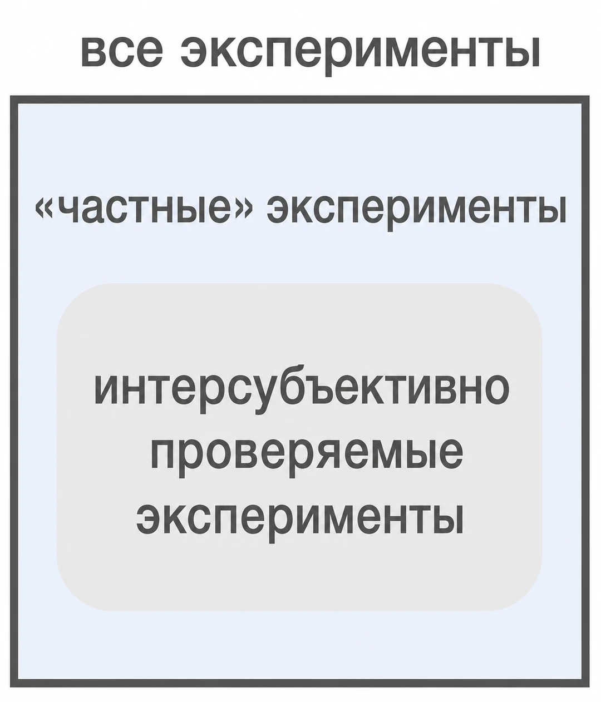

Обычно наука занимается экспериментами, результаты которых может увидеть и проанализировать каждый — серая область на рисунке. Цель алгоритмического идеализма — расширить область применимости на все фундаментальные физические эксперименты, включая «частные».

**Q3:** Это не похоже на науку! Чего стоят предсказания, если никто не может их проверить?
**A:** Цель — единая теория, дающая **предсказания обоих типов**: как интерсубъективно проверяемые, так и непроверяемые таким образом. Если коллективно проверяемые «стандартные» предсказания оказываются верны, это служит свидетельством в пользу более экзотических частных предсказаний.

**Q4:** Можно привести конкретные примеры?
**A:** В зависимости от математической модели алгоритмический идеализм предлагает, например, вероятностный ответ на вопрос пациента из статьи: «Проснусь ли я в компьютерной симуляции?» Ответ зависит от информационно-теоретической структуры «я» пациента и симуляции. Теория также говорит, что вам не следует считать себя больцмановским мозгом, сколько бы таких мозгов ни существовало во Вселенной, что важно для космологии. Она указывает, чего ожидать при дублировании в духе Парфита и во что следует верить искусственному интеллекту при копировании. Наконец, симулированные существа в общем случае не прекращают существование при выключении симуляции.

**Q5:** Даже если такие далёкие сценарии интересны, почему я должен доверять предсказаниям теории?
**A:** Потому что она предсказывает кое-что из того, что мы действительно наблюдаем. В отличие от стандартной физики, которая просто принимает это как данность, алгоритмический идеализм предсказывает: агентам обычно будет казаться, что они встроены во внешний мир с алгоритмически простыми вероятностными законами. С точностью до выбора математических деталей это, вероятно, простейшая экстраполяция научного метода из обычной области в «экзотическую».

**Q6:** В каком смысле это экстраполяция научного метода?
**A:** Наука, помимо прочего, берёт наблюдаемые данные и методом индукции предсказывает будущие наблюдения. Универсальная индукция — математически формализуемая версия такого метода, основанная на алгоритмической теории информации. При некоторых версиях тезиса Чёрча — Тьюринга она даёт доказуемо правильные физические предсказания в стандартном режиме. Алгоритмический идеализм можно понимать как простое предписание: «*Предположим, что универсальная индукция в принципе работает во всех режимах*».

**Q7:** **Идеализм мёртв.** Он никогда не объяснит, почему нам кажется, что существует закономерный внешний физический мир.
**A:** Алгоритмический идеализм, строго говоря, не разновидность идеализма. Он начинает с понятия «я», а не «мира» — отсюда название, — но плохо укладывается в философскую категорию. Например, он **не связан напрямую с сознанием**. Главное же: существование внешнего мира, управляемого простыми законами, здесь не чудо, а *предсказание*. В этом смысле подход преодолевает, вероятно, самую серьёзную проблему идеализма.

**Q8:** Я **реалист**, и подобные бессмысленные теории меня не интересуют.
**A:** Каждый вправе игнорировать мой подход, но вспомните, *почему* вы реалист. Вероятно, вы цените интеллектуальную честность и научный метод; хотите утверждать, что объекты науки реальны в сильном смысле; возможно, решительно выступаете против псевдонауки, мистики и прочей бессмыслицы. **Алгоритмический идеализм всё это разделяет.** Он не утверждает, что мир «нереален», а лишь отрицает его фундаментальность. Это математически строгий и допускающий несколько путей опровержения подход. Его цель — не отвечать на вопрос «из чего на самом деле состоит мир?», а делать конкретные предсказания, пусть и для необычных сценариев.

**Q9:** Не выдвигаете ли вы излишне **спекулятивные** тезисы, отказываясь от большинства интуитивных метафизических предпосылок?
**A:** Спекулятивность и контринтуитивность — совершенно разные вещи. Многие философы считают слабостью теории то, что она противоречит интуиции и предполагает «экстравагантную метафизику». По-моему, это ошибка: всякий существенный прогресс физики разрушал часть прежних интуитивных метафизических предпосылок.

**Q10:** Если «интуитивная метафизика» не входит в ваши ценности, то что входит?
**A:** **Математическая строгость, концептуальная ясность, простота и эмпирическая адекватность.** Интересная теория, конечно, должна быть полезна — например, давать конкретные предсказания для интересующих нас сценариев. Но совпадает ли она с человеческой интуицией, несущественно. Интуиция эволюционировала ради выживания и размножения, а не ради понимания реальности за пределами её связи с этими целями.

**Q11:** Алгоритмический идеализм предсказывает, что внешний мир — компьютерная программа. Но мир непрерывен, а не дискретен! Разве это не наивная «цифровая физика»?
**A:** Алгоритмический идеализм **не утверждает наивную дискретность мира**. Дискретным моделируется лишь *состояние наблюдателя* — подумайте о данных наблюдений и памяти, — да и это не обязательно и меняется при выборе другой модели. Для внешнего мира важна не наивная дискретность пространства-времени в духе клеточного автомата, а **физическая версия тезиса Чёрча — Тьюринга**: существует алгоритм, вычисляющий по описанию эксперимента вероятности возможных исходов. Это совместимо с разными видами непрерывности; многие непрерывные математические структуры, включая задаваемые дифференциальными уравнениями, имеют конечные определения. Алгоритмический идеализм предсказывает, что внешний мир по существу является **вычислительным процессом**, но не утверждает, что для его «обитателей» он внутренне похож на придуманные людьми модели — машины Тьюринга или клеточные автоматы.

**Q12:** Но мир **квантовый**, а не классически вероятностный! В формализме я вижу только статистические вероятностные утверждения, а не квантовые состояния.
**A:** Все эмпирические предсказания квантовой теории относятся к вероятностям исходов измерений, записей или переживаний — этим исчерпывается всё, что мы когда-либо видели в эксперименте. Вероятности правила Борна ведут себя неожиданно, «неклассически»: например, нарушают неравенства Белла в причинной структуре белловского сценария, где голая классическая теория вероятностей такого не допускает. Но это всё равно *вероятности*. Как показано в моей статье 2020 года, квантовое вычисление является допустимой «вычислительной онтологической моделью» и потому возможным внешним миром, в который агент может обнаружить себя встроенным. Внешний квантовый мир полностью совместим с алгоритмическим идеализмом.

**Q13:** Но можно было с самого начала встроить формализм квантовой теории. Почему вы этого не сделали?
**A:** Я надеюсь показать, что некоторые неклассические черты квантовой теории являются предсказаниями алгоритмического идеализма. И наоборот: если окажется, что агентам обычно предсказывается полностью классическая феноменология, это **возможность опровергнуть** теорию. В статье 2020 года дан предварительный результат — корректная теорема, всё ещё опирающаяся на слишком много предположений, — согласно которому алгоритмический идеализм иногда приводит к нарушению неравенств Белла при сохранении запрета сигнализации. Интуитивно это связано с тем, что «сброс состояния „я“ агента сбрасывает его внешний мир», порождая контринтуитивные и невозможные в стандартной классической онтологии статистические последствия, сходные с «космологическими лазейками детектирования».

**Q14:** Как алгоритмический идеализм связан с QBism и многомировой интерпретацией?
**A:** Я глубоко уважаю исследователей обеих интерпретаций и их вариантов, включая другие неокопенгагенские подходы, и серьёзно интересуюсь ими. Будь я реалистом, я придерживался бы многомировой интерпретации. Но смысл алгоритмического идеализма именно в отказе от реализма в традиционном смысле: традиционный реализм принципиально мешает даже *попытаться* построить строгую теорию для целевых вопросов — вспомните [раздел 1](#Section1). При этом я не думаю, что какой-либо будущий эксперимент войдёт в противоречие с многомировой картиной, и *технически* она мне очень интересна: задача вывести правило Борна для ветвящихся наблюдателей частично пересекается с задачей алгоритмического идеализма определить вероятности переходов между состояниями «я».

Что касается QBism, мне близки его взгляды. Я согласен, что квантовое состояние лучше понимать как «каталог вероятностей» будущего опыта агента. Однако есть и место, и необходимость для вероятностей, более близких к «объективным шансам», чем к «личным убеждениям». Оба понятия вполне могут сосуществовать в одном формализме.

**Q15:** Так какова всё-таки ваша интерпретация квантовой теории?
**A:** Часть ответа содержится в основном тексте. Модификация QBism Бергхофера кажется мне привлекательной, полезной и в значительной мере совпадающей с моим пониманием квантового состояния. Физика имеет дело с вероятностями, сообщающими не то, во что вы верите, а то, во что вам *следует* верить.

Но если под «интерпретацией» понимать традиционный удобный рассказ о том, «что в мире происходит на самом деле», интерпретировать квантовую теорию мне просто неинтересно. Понятия «мира» и «того, что действительно происходит» не имеют для меня фундаментального значения. Если же проект интерпретации понимать шире — как попытку понять, чему квантовая теория учит нас о природе реальности, — он чрезвычайно интересен. Предложение алгоритмического идеализма, помимо прочего, является вкладом в этот проект.

**Q16:** Значит, вы предлагаете «теорию всего»? Это нелепо и поднимает вашу работу высоко в моём [индексе безумных теорий](https://math.ucr.edu/home/baez/crackpot.html)!
**A:** **Это не теория всего!** Она ничего не говорит почти обо всех вопросах, интересующих большинство физиков, — например, о квантовой гравитации или физике частиц. Главная гипотеза действительно выдвигает необычный фундаментальный тезис, объясняющий, почему вообще наблюдаются простые физические законы. Но она предсказывает только их *алгоритмическую простоту и вероятностную природу*, а *не конкретную форму*. Объявляя эту форму контингентной, алгоритмический идеализм предсказывает неизбежность собственных ограничений.

**Q17:** Почему это пока незавершённая работа? Что такое **«проблема стирания»**?
**A:** Алгоритмический идеализм — общий подход с несколькими конкретными математическими формализациями, или моделями. Историческая формализация АТИ привела к тому, что простейшая «битовая модель» предполагает рост состояний «я» по одному биту. Фундаментальное стирание информации в ней невозможно, а это предположение не обосновано и, вероятно, верно лишь приближённо в идеализированных ситуациях. Проблема стирания — построить альтернативную модель, допускающую фундаментальное стирание информации состояния «я», но сохраняющую аналоги доказанных для битовой модели теорем, включая возникновение простого вероятностного внешнего мира. Именно над этим я сейчас работаю.

**Q18:** Можно ли **проверить** алгоритмический идеализм?
**A:** В определённом смысле **да**, хотя здесь много нюансов. Обычно под «золотым стандартом» понимают ситуацию, когда теория даёт новое неожиданное предсказание, строится эксперимент и результат подтверждается. В фундаментальной физике последних десятилетий соответствовать этому стандарту всё сложнее, а возможно, уже невозможно. Ни одну теорию квантовой гравитации так проверить не удалось; даже показать переход конкретной теории к общей относительности на больших масштабах — уже превосходный первый тест.

Первый тест алгоритмического идеализма — **воспроизводит ли он с хорошей точностью стандартную физическую картину**: обнаружение себя во внешнем мире с простыми вероятностными законами и неклассическое, в конечном счёте квантовое поведение вероятностей. Первое уже доказано теоремой, второе остаётся работой в процессе с некоторыми предварительными результатами. Теория может не воспроизвести наблюдаемое множеством способов — например, предсказать крупные флуктуации «законов природы», которых мы не видим, и быть опровергнутой.

Второй тест — **допускает ли теория непротиворечивое рассмотрение целевых концептуальных загадок**, например проблемы больцмановского мозга. Она могла бы потерпеть неудачу и привести к «когнитивной нестабильности», о которой писал Кэрролл. Пока, как объясняет основной текст, результаты обнадёживают, но проверки нужно продолжать.

Третий способ следует из типа целевых предсказаний: экспериментов, которые можно провести и проанализировать частным, но не интерсубъективным образом. Поэтому теорию в принципе можно **проверять частными экспериментами**. Сюда входят научно-фантастические сценарии симуляции из [раздела 1](#Section1), но также эксперимент, который однажды каждый проведёт совершенно частным образом, — смерть. Некоторые модели предполагают, что смерть следует понимать не как переход в «вечное бессознательное состояние», а как своего рода «выпадение из Вселенной». Из-за проблемы отсутствия стирания конкретных утверждений пока нет. Если появится модель, которая их даст, её в принципе можно будет так проверить — хотя по дороге вы, возможно, забудете, что именно проверяли.

**Q19:** Ваши агенты и наблюдатели слишком пассивны: они случайно переходят между состояниями «я», ничего не выбирая и не совершая действий. В частности, у них **нет свободы воли**. Это отвратительно и фундаментально неверно.
**A:** Во-первых, такая критика не специфична для алгоритмического идеализма: в неизменном виде она **относится ко всем установленным физическим теориям**. Ни классическая механика, ни общая относительность, ни квантовая механика, квантовая теория поля, термодинамика или любая другая физическая теория не включают «свободу воли» в фундаментальные уравнения и постулаты. И неслучайно: свобода воли — понятие высокого уровня вроде красоты или сознания, плохо укладывающееся в простой формальный математический аппарат.

Во-вторых, **компатибилисты** вроде Дэниела Деннета, на мой взгляд, убедительно показали совместимость свободы воли с детерминизмом. Я согласен с Деннетом не во всём — например, не являюсь иллюзионистом относительно сознания, — но здесь он по существу прав: вместо вопроса «мог ли человек поступить иначе?» следует спрашивать, является ли он источником своих решений и действий. Коротко говоря, я твёрдо верю, что **у нас есть свобода воли**, и это не противоречит отсутствию свободного выбора в явном виде в физических законах. В контексте алгоритмического идеализма спор ничем не отличается от спора в любой другой физической теории.

**Q20:** Но я **операционалист** и считаю понятие **свободного выбора** крайне важным для понимания квантовой теории — хотя бы чтобы говорить о нарушении неравенств Белла.
**A:** «Свободный выбор» настроек измерения в белловском сценарии — причинно-статистическое, а не метафизическое понятие. Оно означает, что переменные $x$, $y$, задающие выборы пространственно разделённых экспериментаторов, не коррелируют со всеми релевантными переменными вне их будущих световых конусов. Такая формулировка независима от метафизики свободы воли. Для обсуждения экспериментов в рамках квантовой, классической или алгоритмически-идеалистической теории действительно нужно понятие вмешательства, но оно может быть *эффективным*. В классической механике — возможность в некотором смысле контролировать начальные условия механического опыта; в квантовой — использование половины запутанного состояния, смешанного состояния, для управления настройкой. В статье 2020 года приведён аналогичный пример для алгоритмического идеализма и показано, почему нарушение неравенств Белла при запрете сигнализации при некоторых предположениях является общим предсказанием. Итак, можно быть операционалистом без метафизического понятия свободы воли и без фундаментального внедрения «свободного выбора» в базовые постулаты теории.

**Q21:** В битовой модели универсальное априорное распределение определяет вероятности будущих наблюдений, поэтому следовало бы ожидать **«простого» состояния «я» с малой сложностью Колмогорова**. Но мы, по опыту, совершаем **крайне сложные наблюдения** — например, видим длинные последовательности бросков монеты. Разве это не очевидное **противоречие**?
**A:** Это распространённое заблуждение: состояние «я» $x$ *необязательно* имеет малую сложность Колмогорова. Теорема об «обратной индукции Соломонова» яснее всего выражает другое ожидание: в долгосрочной перспективе $x$ будет типичным исходом «простого» стохастического процесса $\mu$. «Простота» означает короткую программу $\mu$ на универсальной монотонной машине Тьюринга, а такие машины получают случайные биты бесплатно. Например, процесс независимых одинаково распределённых бросков монеты прост в этом смысле. Но типичные последовательности его исходов обладают высокой сложностью Колмогорова. Итак, теория предсказывает встроенность в простой вероятностный процесс — «внешний мир», — но **конкретные наблюдаемые результаты этого простого процесса обычно очень сложны**. Это в целом согласуется с физическими наблюдениями.

**Q22:** Если что-то и определяет моё состояние «я», то это **мозг**, и ничто другое. Разве ваш вероятностный закон не отрицает этого, постулируя неправдоподобное мистическое внематериальное влияние?
**A:** Алгоритмический идеализм согласен с физикой: в «стандартном режиме», когда вы эффективно встроены в этот внешний мир, эмпирически адекватно считать физическое состояние мозга определяющим опыт. От первого до последнего дня жизни — в повседневности, во сне, медитации или под действием веществ — физическое функционирование мозга исчерпывающе объясняет содержание состояния «я».

Это совместимо с постулатами, потому что разные причинные объяснения часто мирно сосуществуют. Почему существует Великая Китайская стена? Во-первых, жителям древнего Китая требовалась защита от кочевых народов Евразийской степи, и они решили её построить. Во-вторых, из-за начального состояния Вселенной и физических законов атомы стены заняли нынешние положения. Оба объяснения верны, хотя, возможно, неодинаково полезны, и не противоречат друг другу, даже предлагая на вид конкурирующие ответы. Так и на вопрос «что причиняет моё состояние „я“?» можно ответить «мой мозг» или «универсальное априорное распределение» — ответы спокойно сосуществуют.

В битовой модели состояние «я» фундаментально определяется условной алгоритмической вероятностью. Но *именно вследствие этого* его долгосрочная эволюция часто выглядит *так, словно* оно встроено во внешний мир $W$, включая мозг, который можно считать механической причиной этой эволюции. Это выражает результат об обратной индукции Соломонова.

Итак, алгоритмический идеализм не отрицает, что **состояние «я» в некотором смысле супервентно на мозге**. Он предлагает более глубокое объяснение, почему это так, и предполагает, что супервентность выполняется при определённых условиях. В нашей жизни они соблюдаются почти всегда, но не во всех экзотических ситуациях — дублировании, компьютерной симуляции или смерти.

Новые вопросы будут время от времени добавляться.
